# 海量数据处理

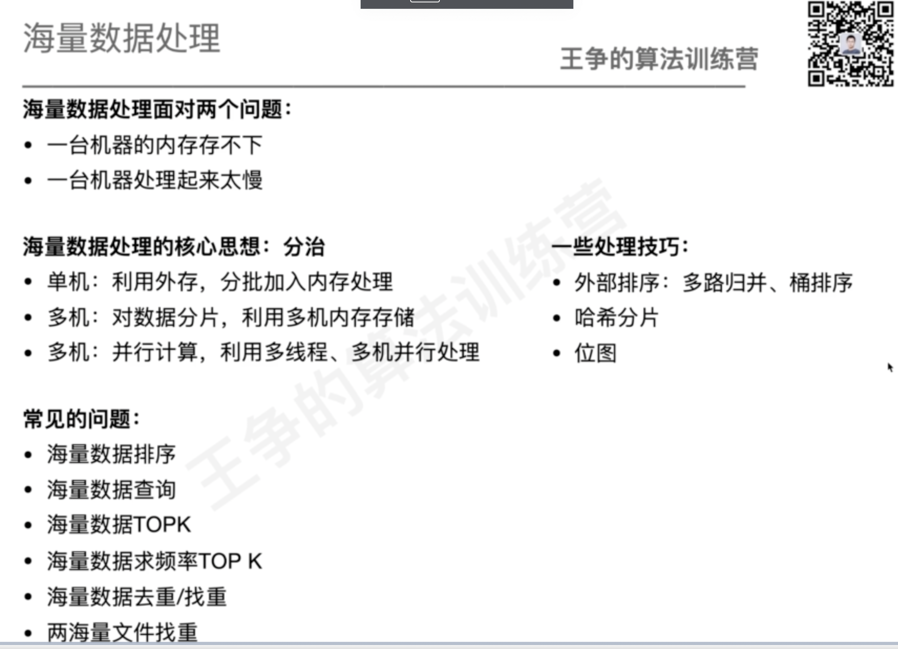

 多机计算：mapreduce思路

处理技巧：

位图：节省存储空间

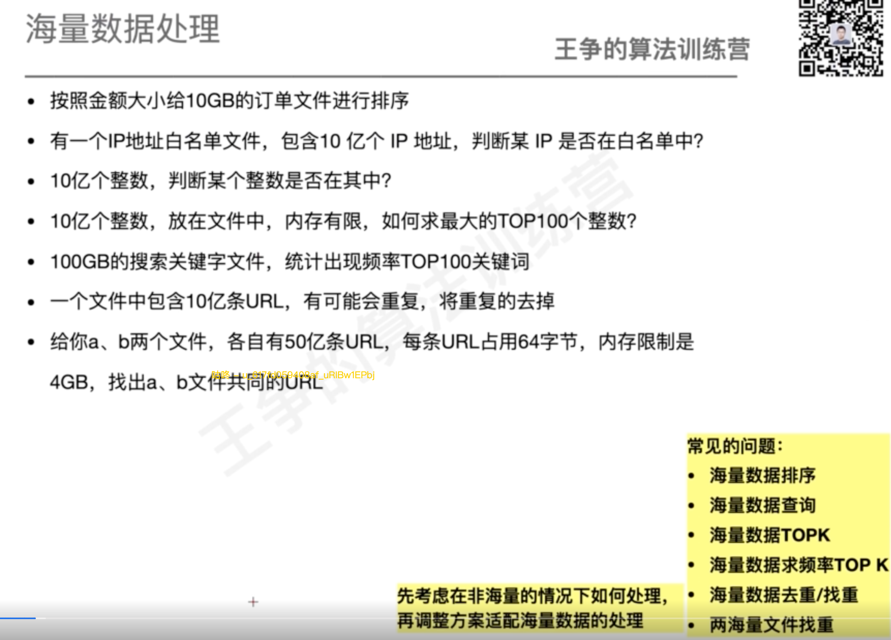

问题1：机器内存能否一次处理10G？能怎么样，不能怎么样？（离线处理）

假设不能放到内存，怎么处理？

假设机器内存1.5G，如何处理？

一次读取1G（大概）的文件，预留0.5G做临时变量，排序需要的额外空间等。

一次排序1G，内存中排好顺序后写会小文件中，但注意不要使用归并排序，会额外申请1G空间

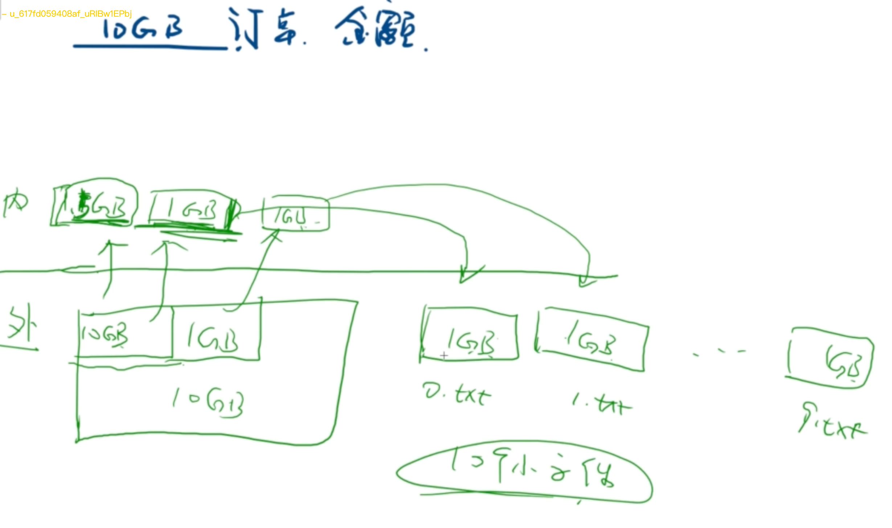

10个有序的小文件，我们合并成一个大的有序文件。

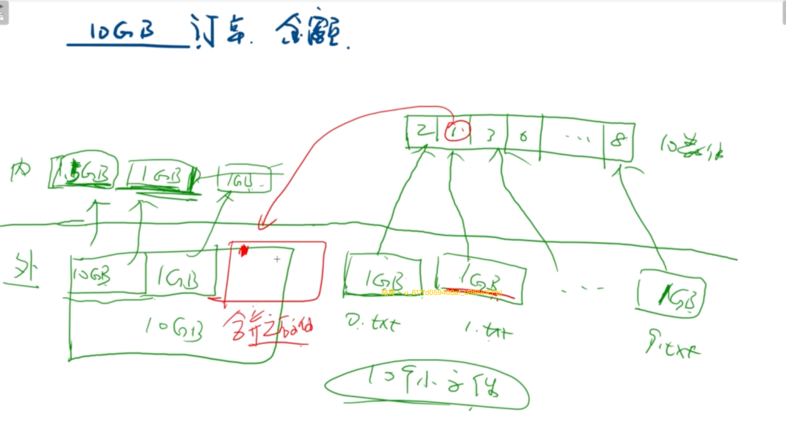

参考K个有序链表合并：每个文件取最小值放到一个size为10的数组中，找到最小的，然后在外存中开辟一个文件，放最小值，然后再取小文件下一个值，继续处理。

优化点：

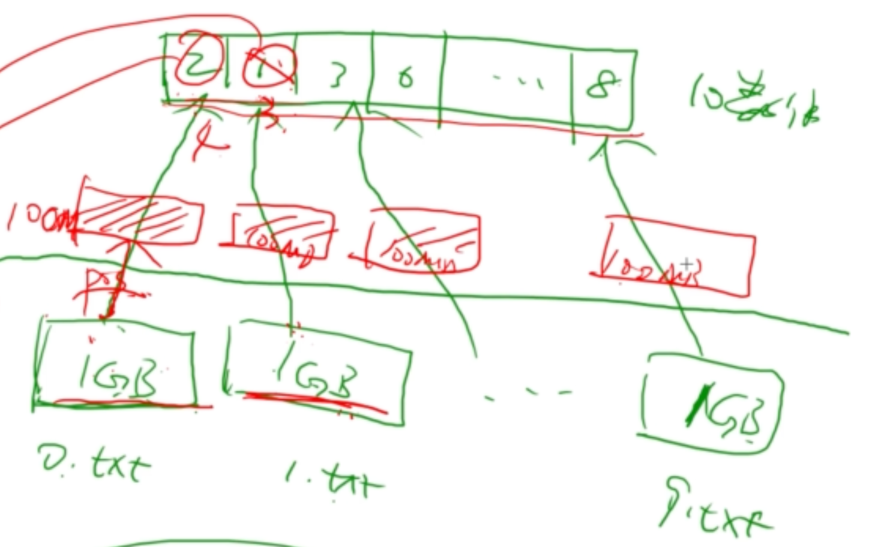

不要每次读一条数据，而是开辟缓存，每次读100M缓存到内存中；因为IO操作比较慢，尽量减少读取磁盘的次数。

上述用到的思路是单机情况多路归并的思路。

针对多机情况，假设我们有10台机器，那么可以每台机器读取1GB的文件进行排序，同时排序；然后再按上述思路写到内存中，再进行最终的排序。

上述问题其实还可以用桶排序的思路来进行处理：

扫描一遍数据，可知订单金额范围，假设是0-999；

那么我们可以按照订单金额大小来进行小文件的拆分，如图所示：

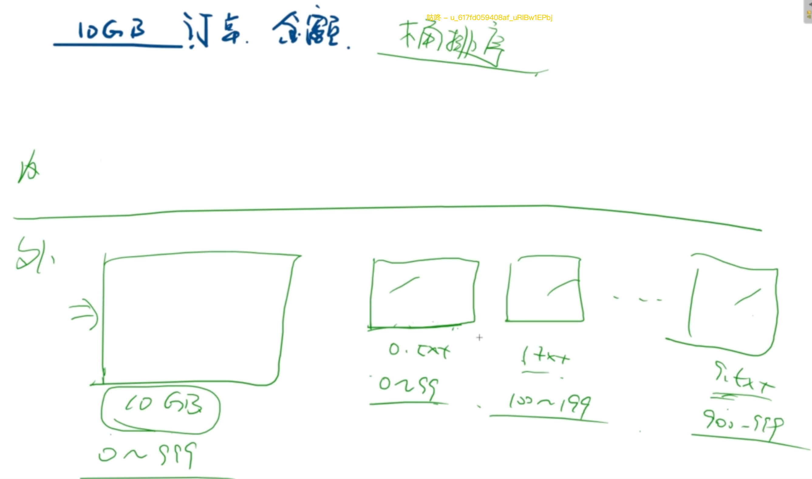

假设订单金额分布均匀，那么刚好可以划分为每个文件大小小于1GB；

如果某个文件大于1GB，那么我们再按照刚刚的思路继续划分这个小文件为更小的文件；

对于桶排序的处理思路来说，每个小文件有序，我们最终需要把小文件合并到一个大文件中；

只需要顺序读取这几个文件写会大文件即可。

问题2：IP地址（10亿个）白名单问题；海量数据查询问题（实时服务）

假设单机能放下？假设有多机？和之前问题一致

IP地址：32位整数，4个字节；

10亿个IP：4GB

内存1G中构造：hash、红黑树、位图

红黑树、hash表都会超1GB；

位图：

int类型数据范围：0~2^32-1；

所以位图需要2^32个二进制位来存储，即2^32 / 8个字节：500M

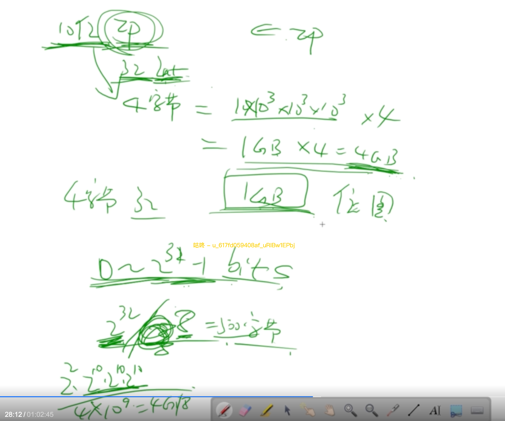

500M的位图即可表示2^32个数据；

某个ip地址存在即该位标记为1；

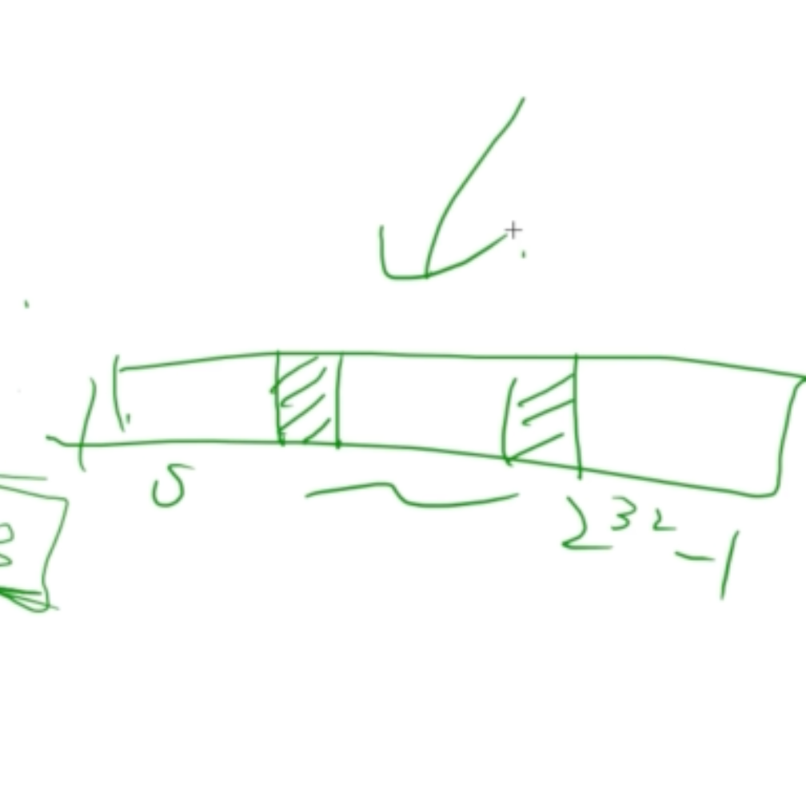

假设每个机器内存只有200M，怎么处理呢？

对于白名单这种需要快速实时检索类型，我们不考虑放到外存中慢慢查；

所以考虑使用多机方式来快速检索；

假设4台机器，每台2.5G内存

每个IP先求MD5，再对4求余，判断放在哪个机器中；

10亿个IP地址分到4台机器上，然后每台机器再构建快速查询的结构（hash表、红黑树、位图等）；

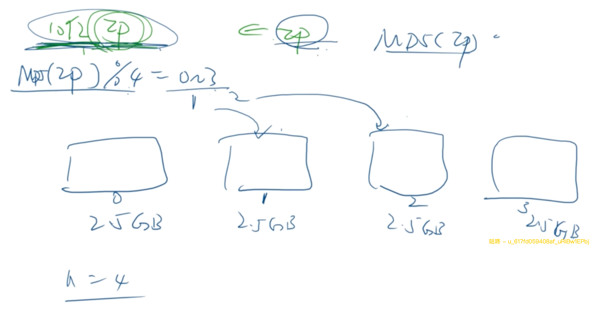

查找时，我们可以使用同样的方式，IP先求MD5，再对4求余，判断在哪台机器上判断是否在白名单内；

当前思路：：多机处理+hash分片；

md5的原因：尽可能随机分片，确保每台数据存储分布均匀。md5随机性很好。

问题3:10亿个整数求TOP100

假设10亿个整数可以一次性加载到内存中处理，直接用堆即可。

如果不能呢？

思路一样，内存中还是构建一个大小为100的小顶堆；从外存读取数据到内存，放到小顶堆。

优化思路：一次不只读一个数；

问题4:100GB搜索关键字文件，统计出现频率TOP100关键词

统计每个关键词出现的频率；

用堆的方式按照频率统计TOP100即可；

如何统计频率：

（1）先排序，顺序扫描即可；

（2）hash表统计；

100G无法一次加载到内存，怎么统计频率呢？

思路1：排序扫描后统计频率；

对100GB关键词排序（问题1的思路，多路归并）生成100GB有序文件。

顺序扫描排序后的有序文件，生成新的文件，文件内容包含&#123;"关键字"："出现次数"&#125;这样的key-val文件；

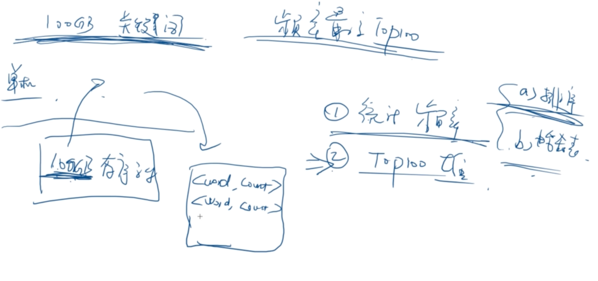

之后对于key-val文件，我们又可以回到问题3，求TOP100即可。

思路2：hash表统计频率

假设机器有12GB空间，2GB预留；

每个关键词求MD5，对10求余，落到0-9的范围内；

我们先把余数为0的加载到内存中，然后统计出现的频率，可以使用hash表，然后写到小文件里面；

然后再扫描余数为1的关键词加载到内存中，同上方法写到小文件里面；

以此类推，扫描余数2-9的关键字，最终生成10个10GB的小文件，每个小文件中都是关键词：出现频率这样的小文件。

内存中开辟一个容量为100的小顶堆，依次读取10个文件，即可得到最终的。

此为hash表思路处理。

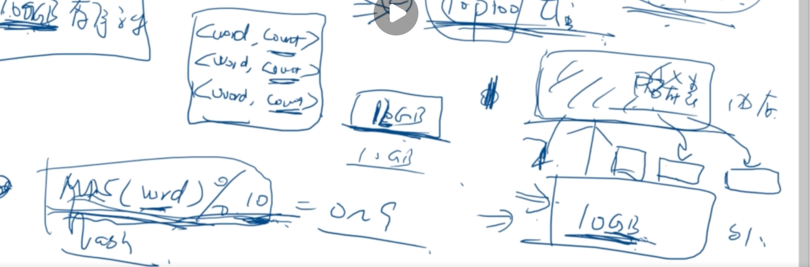

优化：多机处理，分别对不同余数的关键词同时进行频率统计

问题5：

10亿个URL，去重；

1个url我们预估为64个字节；（随便预估，也可128）

所以10亿个总量为64GB；

假设内存中能放下，怎么去重？

（1）排序后顺序扫描；

（2）基于hash表。

内存中放不下，仍然沿用上面的思路；

（1）海量数据排序，如上文

内存中定义一个变量，记录上次的url是哪一个；

每次从外存中取一个url，和该值对比，如果不同就放进新的文件数组中，然后更新内存中的url；如果相同就不放入。

优化：

开辟100M的读缓存，每次读取一批数据，在内存中进行处理；

去重处理时，再开辟一个100M的写缓存。放到输出缓存中；

缓存写满时再刷新到外部文件中。

（2）基于hash表的方式

url进行MD5，对8求余（64G大小文件），hash分片到 0~7；

hash值为0的，全部放到内存中；

在内存中去重（排序或hash表）；

去重后再放到单独的外部小文件中；

之后再对hash值为1~7的以此类推处理；

最后将8个小文件合并起来即可获取最终的去重文件。

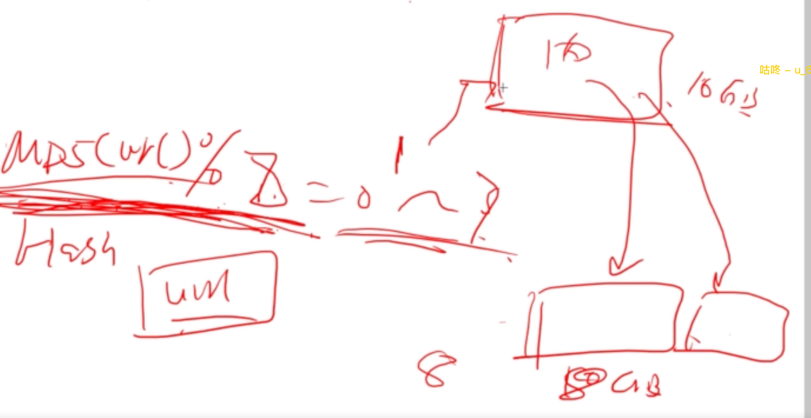

问题6：

a、b两个文件，各有50亿url，每条url64字节，内存限制4GB，找出a、b共同的url；

内存处理：

（1）排序+双指针

（2）hash表

海量处理：

（1）排序+双指针

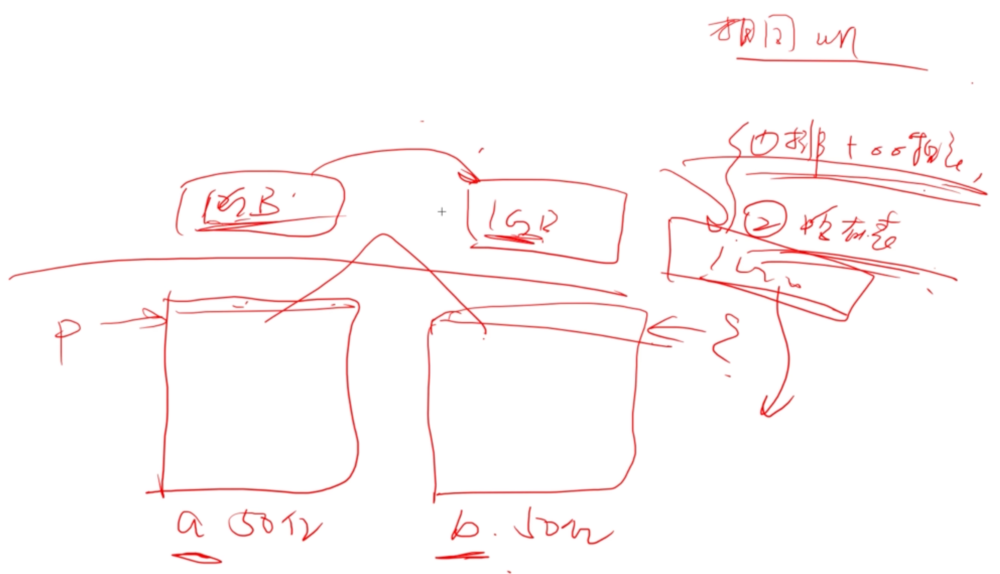

海量数据先排序；

各自p、q指针，后移的方式，相等就放到新文件中；

优化：1GB读、写缓存

（2）hash表

扫描a、b，MD5(url) % 20=hash

hash为0的放在内存中，找相同的值，放在新文件中

扫描a、b，MD5(url) % 20=hash

hash为1的放在内存中，找相同的值，放在新文件中

依次类推...

但是这样会扫描20遍文件，可以进行优化；

多机情况下，只需要扫描一次，对不同hash值的放到不同机器上进行处理即可。

单台机器是否也可以不扫描20遍？

先扫描一遍，放到20个文件中；

然后扫描20次，但是每次只扫描对应编号的小文件，这样相当于每条数据只被扫描了两遍。

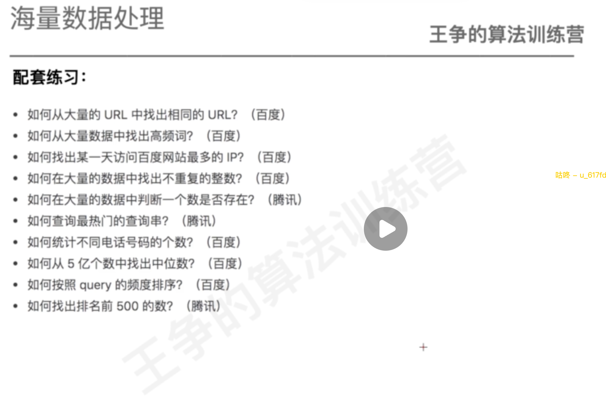
