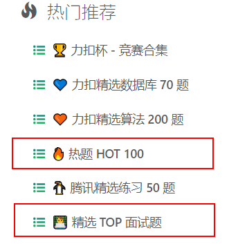

# 力扣常见面试题

常见面试题

1. 面试高频类型：数组，链表，字符串，动态规划，贪心，回溯，二叉树。

2. 优先刷力扣 热题HOT100 和 精选TOP面试题 ，如果时间实在来不及，可以刷下面的高频面试题目。

3. 看题解没思路的话，可以看B站题解视频，花花酱的表世界。

推荐题目：

（完成第一遍：黑色；第二遍：蓝色；）

三数之和

买卖股票的最佳时机

买卖股票的最佳时机 II

二叉树的层序遍历

二叉树中的最大路径和 124

爬楼梯

从前序与中序遍历序列构造二叉树

存在重复元素

数据流的中位数

寻找重复数

加油站

括号生成

打家劫舍

数组中的第K个最大元素 215

LRU缓存机制

最长连续序列

最长上升子序列

最长回文子串

二叉树的最近公共祖先

乘积最大子数组

位1的个数

完全平方数

Pow(x, n)

只出现一次的数字

对称二叉树

两数之和

全排列

最短无序连续子数组

和为K的子数组

二叉树的直径

脉脉推荐面试高频题
