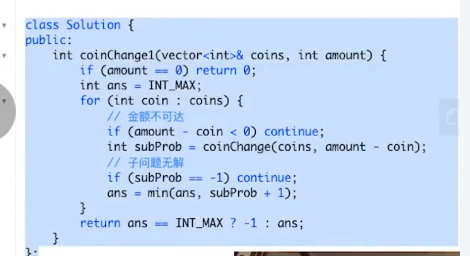

# 算法题的重复性

1. 重复性：归纳法

重复性->分治 DP

322.

f(n)  = min(f(n-1), f(n-2)) + 1;

f(n) = min(f(amount - coins(i)))  for i in coins + 1

91.

numDecoding("226") = numDecoding("26") +numDecoding("6")

f(n) = f(n - 1) + f(n - 2)

numDecoding(n) = numDecoding(n-1) +numDecoding(n-2)

if (s[0] != 0)  cnt += s[s:1]

if (s[s:2] >= 10 and s[s:2] &lt;= 26) cnt += s[s:2]
