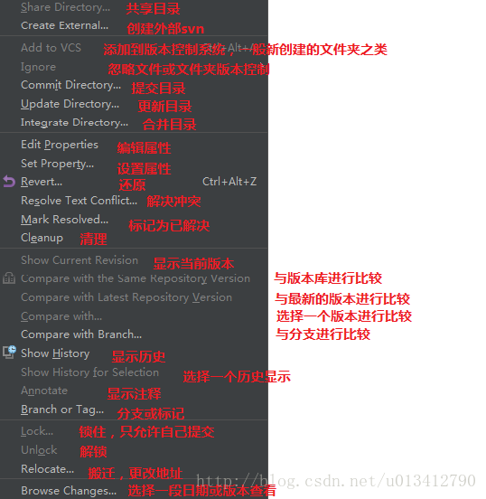
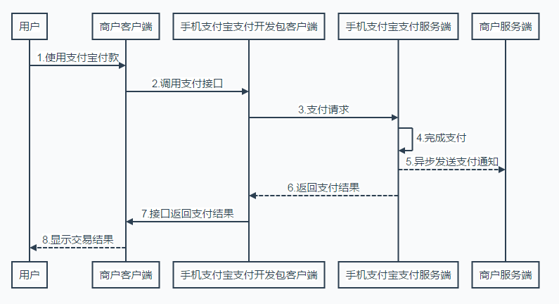
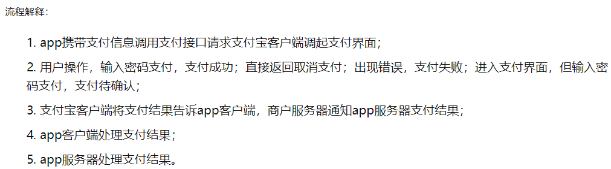
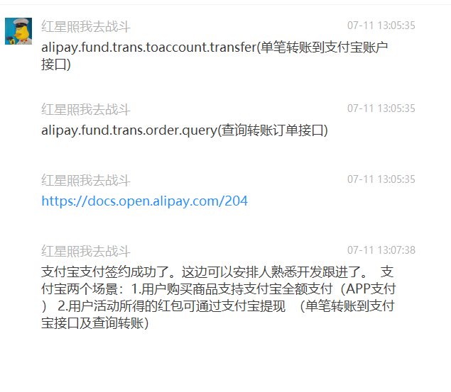

# 支付系统

支付方式

支付宝

当面付-扫码支付

APPID = [REDACTED]

@GetMapping("user/&#123;username&#125;")    ---   (@PathVariable("username") String username)

@ConfigurationProperties(prefix="")与@Value

@Data+Lombok简化代码

&lt;dependency>
            &lt;groupId>org.projectlombok&lt;/groupId>
            &lt;artifactId>lombok&lt;/artifactId>
            &lt;version>1.16.10&lt;/version>

&lt;dependency>

支付模块

7048-1565659612027支付流程04Arial041604#333333

6641-1565659612027一般流程：05Arial051605#333333

7984-1565659612027收集前端数据调用新浪支付接口014Arial01416014#333333

java_demo_zhanghu\com\sina\servlet\send\Send.Class

7948-1565659612027对账流程04Arial041604#333333

3084-1565659612027结算流程04Arial041604#333333

SpringCloud

6344-1565659612027创建SpringBoot工程014Arial01416014#333333

4166-1565659612027在pom.xml中配置SpringBoot，SpringCloud，以及需要的SpringCloud组件052Arial05216052#333333

1279-1565659612027配置application.properties或application.yml配置文件044Arial04416044#333333

9411-1565659612027Eureka Server:服务治理中心020Arial02016020#333333

服务注册、发现、治理中心

maven, server, client, 注解注册服务

8171-1565659612027Feign负载均衡与熔断器:014Arial01416014#333333

3260-1565659612027负载均衡:05Arial051605#333333

服务消费者行为：service定义@FeignClient接口，指定调用哪个服务。

Web-Controlelr层：注入SchedualServiceHi schedualServiceHi;

6570-1565659612027熔断器：04Arial041604#333333

4596-1565659612027

支付表结构

3881-1565659612027批量付款到银行卡结果通知012Arial01216012#333333

6696-1565659612027交易结果通知表07Arial071607#333333

1070-1565659612027退款结果通知表07Arial071607#333333

4060-1565659612027出款订单列表06Arial061606#333333

3554-1565659612027提现结果通知表07Arial071607#333333

放款、收款、购买：支付系统流程图

接口统计：

产品类型：

       收款类产品

子账户收款类产品：交易创建，交易付款，交易撤销，交易结算与分润，交易退款，账户提现。

       会员信息：创建激活会员，查询个人会员信息

       实名信息（个人）：设置实名信息

       企业资质：请求审核，查询审核结果。

       账户类：账户充值，充值查询，余额查询，账户收支明细查询。

交易类：交易创建，交易查询，交易关闭，交易付款，支付验证码推进，交易查询，支付结果查询，交易撤销，交易结算，交易退款，退款查询。

付款类：批量付款到银行卡，批次查询接口。

2522-1565659612027

对接新浪支付

收付款产品商户对接流程注意事项       商户技术对接流程注意事项【交易篇】

7096-1565659612027对接新浪支付注意事项010true010Arial01016010#333333

1849-1565659612027获取前台数据->对需要加密的数据进行加密(联调环境密钥&lt;rsa_public.pem>)->对参数加签(加签参数非空)->对加签后的参数做urlencode处理->发送post请求->新浪响应->使用验签公钥验签(空参数不参加验签)->商户后台响应； 其中，我们后台只需要传入参数给Send，获得响应，中间步骤封装到Send中。5658true107115true0164Arial0164160164#333333

4100-1565659612027调用网关需要区分会员类接口和支付类接口；813true1419true020Arial02016020#333333

7591-1565659612027交易类接口交易创建、交易结算、交易撤销、交易关闭、退款这些接口支撑起整个收付款业务的运行。59true1014true1519true2024true2527true045Arial04516045#333333

3215-1565659612027基本参数中的partner_id为平台的商户号。616true024Arial02416024#333333

8900-1565659612027请求新浪接口的方式为post。1015true015Arial01516015#333333

4534-1565659612027请求时间request_time有效期为15分钟（该时间以北京时间为准）。416true037Arial03716037#333333

8677-1565659612028对于交易类有异步通知的接口，我们需要传入异步通知地址(notify_url)用于接收异步通知。2737true047Arial04716047#333333

9555-1565659612028调用接口的请求、响应信息一定要记录在日志中；022Arial02216022#333333

7782-1565659612028

1458-1565659612028交易类接口05true05Arial051605#333333

1045-1565659612028交易关闭（close_b2c_order）：调用的前提是交易状态为“等待付款”(WAIT_PAY)。520true4048true050Arial05016050#333333

4097-1565659612028交易撤销（cancel_b2c_order）：前提条件是订单状态为"付款完成"（PAY_FINISHED）； 该接口受交易结算接口的影响。521true4052true069Arial06916069#333333

1793-1565659612028交易结算（settle_b2c_order）：创建交易时如果选择延迟结算（交易创建表中结算时间不为0）(settlement_time)，则后续可以通过此接口来发起结算;521true5267true085Arial08516085#333333

2016-1565659612028再次支付(pay_order):原交易状态必须为"等待付款"(WAIT_PAY);514true3139true041Arial04116041#333333

8211-1565659612028支付结果同步返回，交易结果异步通知；018Arial01816018#333333

2940-1565659612028响应支付状态：pay_status.26true717true018Arial01816018#333333

8024-1565659612028延长交易结算时间(extend_settle_time):settlement_time，交易状态为"交易结束"（TRADE_FINISHED），交易延迟的时间不能超过交易请求时间之后的45天。927true2944true5771true097Arial09716097#333333

对接支付宝

&lt;dependency>

&lt;groupId>com.alipay.sdk&lt;/groupId>

&lt;artifactId>alipay-sdk-java&lt;/artifactId>

&lt;version>3.7.89.ALL&lt;/version>

&lt;/dependency>
