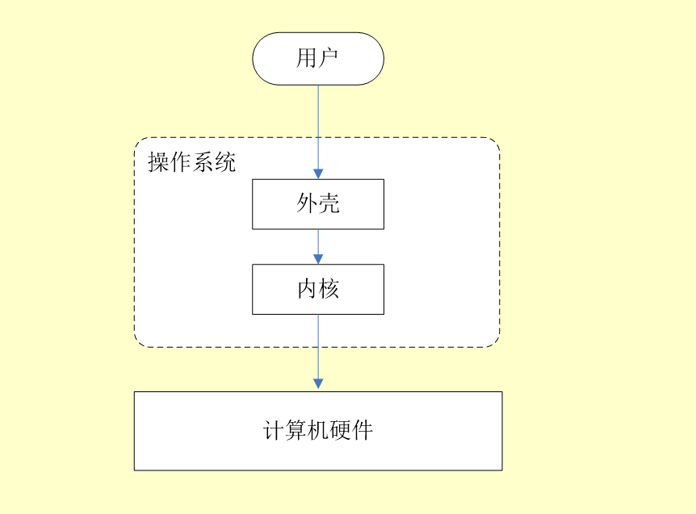

# 操作系统

javaGuide讲解：https://snailclimb.gitee.io/javaguide/#/docs/operating-system/basis

一、什么是操作系统：

1. 操作系统是对计算机硬件和软件资源进行操作的程序，是计算机系统的内核和基石；

2. 操作系统本质上是一种软件应用程序；

3. 操作系统给用户提供与系统进行交互的界面；

4. 操作系统包括内核和外壳。

内核可以直接操作计算机硬件，外壳是围绕在内核周围的应用程序，不能直接和硬件进行交互；

内核是连接应用程序和计算机硬件的桥梁，是计算机系统黑盒的核心。

二、用户态和系统态

用户态和系统态是对进程运行状态的划分：

以用户态运行的进程可以访问用户程序的数据资源；

以系统态运行的进程可以访问计算机的所有资源。

三、系统调用

1. 什么是系统调用：

我们运行的程序是运行在用户态上的，当我们需要调用系统态的功能时，我们没法直接使用这些功能，比如文件系统，内存管理，进程分配，我们就需要向操作系统进行申请，由操作系统代用户态实现这些功能，这以操作就是系统调用。

2. 系统调用的分类:

设备管理：设备的请求和释放，以及设备启动功能；

文件管理：文件的读、写、创建、删除；

进程管理：进程的创建、撤销、阻塞、销毁；

进程通信：进程之间的消息传递和信号传递；

内存管理：完成内存的分配及回收，以及作业占用内存大小的获取以及内存地址相关功能等。
