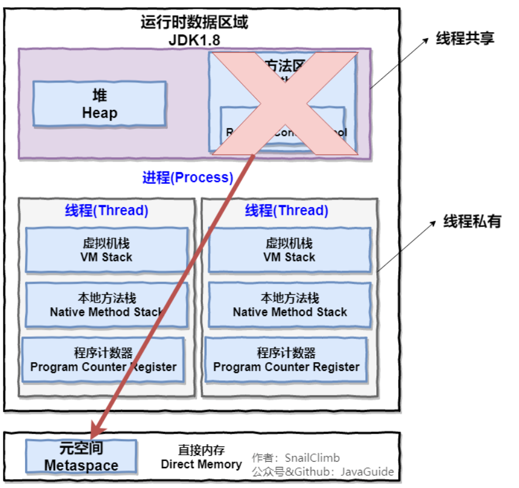
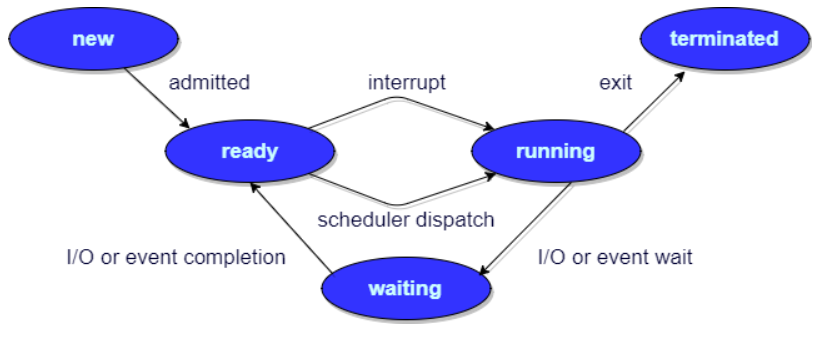

# 进程与线程

javaGuide讲解：https://snailclimb.gitee.io/javaguide/#/docs/operating-system/basis

一、进程和线程的区别：

1. jvm角度：

同一个进程中的不同线程共享堆和元空间，每个线程都有自己独立的程序计数器，虚拟机栈，本地方

法栈。

2. 进程是分配内存的最小单元，线程是CPU调度的最小单元。

二、进程有哪几种状态：

1. 创建状态：进程被创建，但并未就绪。

2. 就绪状态：进程处于准备运行状态，但并未获得CPU资源，一旦得到CPU分配的时间片即可运行。

3. 运行状态：进程正在处理器上运行。

4. 阻塞状态：等待状态。等待某资源可用或IO操作完成导致的暂停运行状态，即使CPU空闲当前页不能之间进入运行状态。

5. 结束状态：进程正在从系统中消失。可能是进程正常终止或异常中断。

三、进程间通信：

1. 匿名管道：用于具有亲缘关系的父子进程间的通信，存在内存中。管道可以认为是环形队列。

2. 有名管道：有名管道可以用于任意两个进程间的通信，有名管道以磁盘文件的形式存在，严格遵循FIFO。

3. 信号：用于通知接收事件某个进程已经发生。

4. 消息队列：用于解决匿名管道通信局限性，以及有名管道存储在磁盘中导致效率较低产生的。并且，解决了信号承载信息量小以及管道只能传输字节流以及缓冲区大小受限的问题。

消息队列是链表结构，存放在内存的内核中，并由消息队列标识符标识。不仅支持FIFO，也支持随机读取。只有当内核重启或显式删除某个消息队列时才会被删除。

5. 信号量：就是一个计数器。用于解决多进程对同一共享资源的访问。这种通信方式主要用于解决与同步相关的问题并避免竞争条件。

6. 共享内存：使得多个进程可以访问同一块内存空间。这种通信方式需要依赖同步操作，如互斥锁或信号量。这是最有用的进程间通信方式。

7. 套接字：主要用于客户端和服务器之间通过网络进行通信。套接字就是通信双方的一种约定，是支持TCP/IP的网络通信的基本操作单元。

四、线程间的同步方式：

1. 互斥锁：对访问的共享资源进行加锁，同一时间只能有一个线程访问共享资源；比如synchronized和各种Lock机制；

2. 信号量：允许同一时刻多个线程访问同一资源，但是需要控制同一时刻访问资源的线程数量；

3. 事件（wait/notify）：通知等待通知的访问进行多线程的同步，并且可以方便实现多线程优先级的比较。

五、进程的调度算法：

1. 先到先服务（FCFS）调度算法：从就绪队列中选择一个最先进入队列的进程，让它执行到完成任务或进入阻塞状态放弃CPU，之后进行新一轮的调度。

2. 短作业优先（SJF）调度算法：从就绪队列中选择一个预估运行时间最短的进程进行执行，直到完成或进入阻塞状态放弃CPU，之后进行新一轮的调度。

3. 时间片轮转调度算法：是一种最古老，简单，公平，应用广的调度算法，又称RR调度。每个进程被分配一个时间段，即它的时间片，即它的运行时间。

4. 优先级调度：根据内存，时间或其他资源的要求为每个进程分配优先级，然后按照优先级从高到低进行执行，优先级相同的按照FCFS进行执行。

5. 多级反馈队列调度算法：前面几种调度算法都有一定的局限性，该算法既能够平衡短作业优先和优先级调度，是一种公认的较好的调度算法，目前UNIX操作系统采用的就是该算法。
