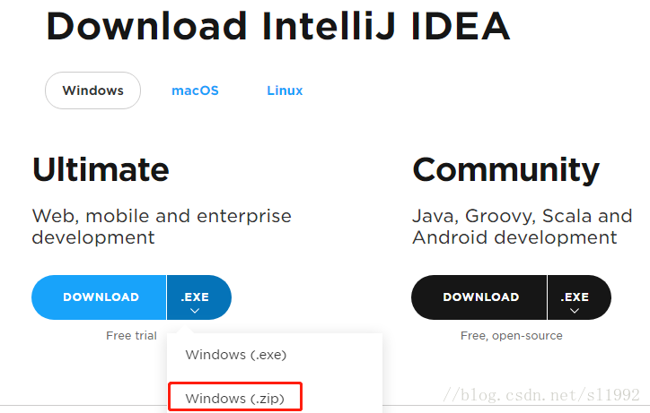
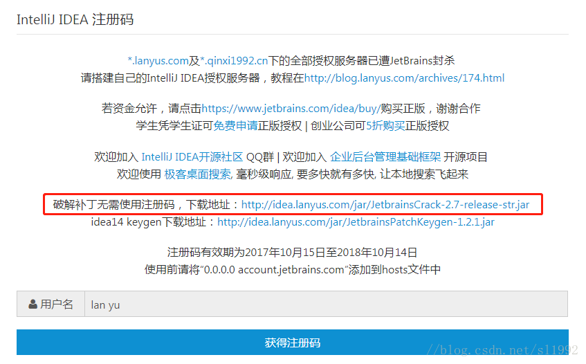
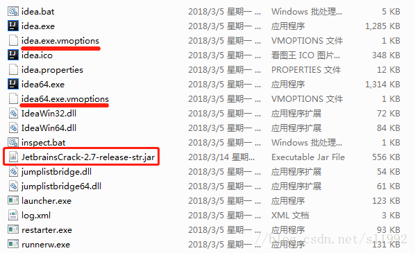
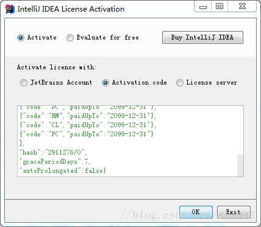
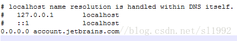
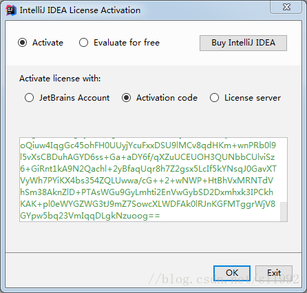

# IDEA2018破解

IntelliJ IDEA 2018激活

2018年03月14日 16:34:22 LifeIsForSharing 阅读数 2802更多

分类专栏： Java

版权声明：本文为博主原创文章，遵循 CC 4.0 BY-SA 版权协议，转载请附上原文出处链接和本声明。

本文链接：https://blog.csdn.net/sl1992/article/details/79556593

2762-1569049992479一.jar包方式破解01016010#6795b5010https://blog.csdn.net/sl1992/article/details/79556593#%E4%B8%80jar%E5%8C%85%E6%96%B9%E5%BC%8F%E7%A0%B4%E8%A7%A31.5

9679-15690499924791.下载IDEA破解包01116011#6795b5011https://blog.csdn.net/sl1992/article/details/79556593#1%E4%B8%8B%E8%BD%BDidea%E7%A0%B4%E8%A7%A3%E5%8C%851.5

9940-15690499924792.修改vmoptions文件01516015#6795b5015https://blog.csdn.net/sl1992/article/details/79556593#2%E4%BF%AE%E6%94%B9vmoptions%E6%96%87%E4%BB%B61.5

5590-15690499924793.激活041604#6795b504https://blog.csdn.net/sl1992/article/details/79556593#3%E6%BF%80%E6%B4%BB1.5

8747-1569049992479二.hosts文件方式破解01316013#6795b5013https://blog.csdn.net/sl1992/article/details/79556593#%E4%BA%8Chosts%E6%96%87%E4%BB%B6%E6%96%B9%E5%BC%8F%E7%A0%B4%E8%A7%A31.5

7070-15690499924791.编辑hosts文件01116011#6795b5011https://blog.csdn.net/sl1992/article/details/79556593#1%E7%BC%96%E8%BE%91hosts%E6%96%87%E4%BB%B61.5

2299-15690499924792.获取注册码071607#6795b507https://blog.csdn.net/sl1992/article/details/79556593#2%E8%8E%B7%E5%8F%96%E6%B3%A8%E5%86%8C%E7%A0%811.5

8612-15690499924793.激活041604#6795b504https://blog.csdn.net/sl1992/article/details/79556593#3%E6%BF%80%E6%B4%BB-11.5

IntelliJ IDEA破解激活

IntelliJ IDEA和Eclipse一样，也可以选择zip免安装方式使用IDEA

一.jar包方式破解

1.下载IDEA破解包

访问地址IntelliJ IDEA 注册码

点击下载破解补丁无需使用注册码,将下载的JetbrainsCrack-2.7-release-str.jar包复制到IDEA安装目录的bin目录下。

2.修改vmoptions文件

进入到IDEA安装目录的bin目录下，

找到idea.exe.vmoptions和idea64.exe.vmoptions文件，以记事本打开分别在最后一行添加以下内容

-javaagent:D:\Program Files (x86)\JetBrains\IntelliJ IDEA 2017.3.5\bin\JetbrainsCrack-2.7-release-str.jar

8523-15690499924791011601#99999901#eef0f4right1.5714285714285714

其中D:\Program Files (x86)\JetBrains\IntelliJ IDEA 2017.3.5\为安装IDEA的目录

3.激活

点击Activation code，复制粘贴以下内容到面板

ThisCrackLicenseId-&#123; 
"licenseId":"ThisCrackLicenseId", 
"licenseeName":"idea", 
"assigneeName":"", 
"assigneeEmail":"idea@163.com", 
"licenseRestriction":"For This Crack, Only Test! Please support genuine!!!", 
"checkConcurrentUse":false, 
"products":[ 
&#123;"code":"II","paidUpTo":"2099-12-31"&#125;, 
&#123;"code":"DM","paidUpTo":"2099-12-31"&#125;, 
&#123;"code":"AC","paidUpTo":"2099-12-31"&#125;, 
&#123;"code":"RS0","paidUpTo":"2099-12-31"&#125;, 
&#123;"code":"WS","paidUpTo":"2099-12-31"&#125;, 
&#123;"code":"DPN","paidUpTo":"2099-12-31"&#125;, 
&#123;"code":"RC","paidUpTo":"2099-12-31"&#125;, 
&#123;"code":"PS","paidUpTo":"2099-12-31"&#125;, 
&#123;"code":"DC","paidUpTo":"2099-12-31"&#125;, 
&#123;"code":"RM","paidUpTo":"2099-12-31"&#125;, 
&#123;"code":"CL","paidUpTo":"2099-12-31"&#125;, 
&#123;"code":"PC","paidUpTo":"2099-12-31"&#125; 
], 
"hash":"2911276/0", 
"gracePeriodDays":7, 
"autoProlongated":false&#125;

至此完成了IDEA的破解。

此方式参考http://blog.csdn.net/everest_man/article/details/78985879

二.hosts文件方式破解

1.编辑hosts文件

进入C:\Windows\System32\drivers\etc目录下，将0.0.0.0 account.jetbrains.com添加到hosts文件中

2.获取注册码

访问IntelliJ IDEA 注册码，点击获得注册码，复制注册码

3.激活

点击Activation code，将复制的注册码粘贴到面板

至此完成了IDEA的破解。

此方式参考http://blog.csdn.net/zx110503/article/details/78734428

本文参考:

http://idea.lanyus.com

http://blog.csdn.net/everest_man/article/details/78985879

http://blog.csdn.net/zx110503/article/details/78734428
