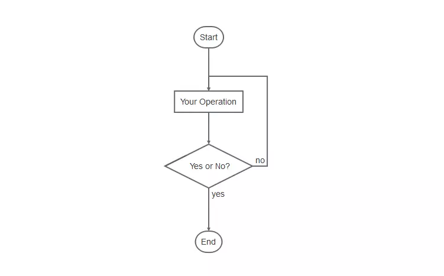

# Markdown基本语法 - 简书

Markdown是一种纯文本格式的标记语言。通过简单的标记语法，它可以使普通文本内容具有一定的格式。

相比WYSIWYG编辑器

优点：

1、因为是纯文本，所以只要支持Markdown的地方都能获得一样的编辑效果，可以让作者摆脱排版的困扰，专心写作。

2、操作简单。比如:WYSIWYG编辑时标记个标题，先选中内容，再点击导航栏的标题按钮，选择几级标题。要三个步骤。而Markdown只需要在标题内容前加#即可

缺点：

1、需要记一些语法（当然，是很简单。五分钟学会）。

2、有些平台不支持Markdown编辑模式。

还好，简书是支持Markdown编辑模式的。

开启方式：设置->默认编辑器->Markdown编辑器

一、标题

在想要设置为标题的文字前面加#来表示

一个#是一级标题，二个#是二级标题，以此类推。支持六级标题。

注：标准语法一般在#后跟个空格再写文字，貌似简书不加空格也行。

示例：

# 这是一级标题## 这是二级标题### 这是三级标题#### 这是四级标题##### 这是五级标题###### 这是六级标题

效果如下：

这是一级标题

这是二级标题

这是三级标题

这是四级标题

这是五级标题

这是六级标题

二、字体

17-1578199499326加粗021802#404040

要加粗的文字左右分别用两个*号包起来

86-1578199499328斜体021802#404040

要倾斜的文字左右分别用一个*号包起来

99-1578199499331斜体加粗041804#404040

要倾斜和加粗的文字左右分别用三个*号包起来

59-1578199499332删除线031803#404040

要加删除线的文字左右分别用两个~~号包起来

示例：

**这是加粗的文字***这是倾斜的文字*`***这是斜体加粗的文字***~~这是加删除线的文字~~

效果如下：

这是加粗的文字

这是倾斜的文字

这是斜体加粗的文字

这是加删除线的文字

三、引用

在引用的文字前加>即可。引用也可以嵌套，如加两个>>三个>>>

n个...

貌似可以一直加下去，但没神马卵用

示例：

>这是引用的内容>>这是引用的内容>>>>>>>>>>这是引用的内容

效果如下：

这是引用的内容

这是引用的内容

这是引用的内容

四、分割线

三个或者三个以上的 - 或者 * 都可以。

示例：

-------********

效果如下：

可以看到，显示效果是一样的。

五、图片

语法：

图片alt就是显示在图片下面的文字，相当于对图片内容的解释。图片title是图片的标题，当鼠标移到图片上时显示的内容。title可加可不加

示例：


效果如下：


blockchain

上传本地图片直接点击导航栏的图片标志，选择图片即可

六、超链接

语法：

[超链接名](超链接地址 "超链接title")title可加可不加

示例：

[简书](http://jianshu.com)[百度](http://baidu.com)

效果如下：

简书

百度

注：Markdown本身语法不支持链接在新页面中打开，貌似简书做了处理，是可以的。别的平台可能就不行了，如果想要在新页面中打开的话可以用html语言的a标签代替。

&lt;ahref="超链接地址"target="_blank">超链接名a>示例&lt;ahref="https://www.jianshu.com/u/1f5ac0cf6a8b"target="_blank">简书a>

七、列表

99-1578199499379无序列表041804#404040

语法：

无序列表用 - + * 任何一种都可以

- 列表内容+ 列表内容* 列表内容注意：- + * 跟内容之间都要有一个空格

效果如下：

30-1578199499382列表内容041604#4040401.8

68-1578199499383列表内容041604#4040401.8

03-1578199499383列表内容041604#4040401.8

60-1578199499384有序列表041804#404040

语法：

数字加点

1.列表内容2.列表内容3.列表内容注意：序号跟内容之间要有空格

效果如下：

1.列表内容

2.列表内容

3.列表内容

68-1578199499387列表嵌套041804#404040

上一级和下一级之间敲三个空格即可

05-1578199499388一级无序列表内容081608#404040

83-1578199499389二级无序列表内容081608#4040401.8

18-1578199499389二级无序列表内容081608#4040401.8

92-1578199499389二级无序列表内容081608#4040401.8

54-1578199499390一级无序列表内容081608#404040

44-1578199499390二级有序列表内容081608#4040401.875

91-1578199499390二级有序列表内容081608#4040401.875

31-1578199499391二级有序列表内容081608#4040401.875

44-1578199499392一级有序列表内容081608#404040

70-1578199499392二级无序列表内容081608#4040401.8

56-1578199499392二级无序列表内容081608#4040401.8

14-1578199499392二级无序列表内容081608#4040401.8

30-1578199499393一级有序列表内容081608#404040

39-1578199499393二级有序列表内容081608#4040401.875

79-1578199499394二级有序列表内容081608#4040401.875

96-1578199499394二级有序列表内容081608#4040401.875

八、表格

语法：

表头|表头|表头---|:--:|---:内容|内容|内容内容|内容|内容第二行分割表头和内容。- 有一个就行，为了对齐，多加了几个文字默认居左-两边加：表示文字居中-右边加：表示文字居右注：原生的语法两边都要用 | 包起来。此处省略

示例：

姓名|技能|排行--|:--:|--:刘备|哭|大哥关羽|打|二哥张飞|骂|三弟

效果如下：

61-1578199499408&#123;"cells":[&#123;"textAlign":"left","verticalAlign":"middle","backColor":"rgba(0, 0, 0, 0)","value":"姓名","inlineStyles":&#123;"bold":[&#123;"from":0,"to":2,"value":true&#125;],"font-size":[&#123;"from":0,"to":2,"value":16&#125;],"color":[&#123;"from":0,"to":2,"value":"#404040"&#125;]&#125;&#125;,&#123;"textAlign":"center","verticalAlign":"middle","backColor":"rgba(0, 0, 0, 0)","value":"技能","inlineStyles":&#123;"bold":[&#123;"from":0,"to":2,"value":true&#125;],"font-size":[&#123;"from":0,"to":2,"value":16&#125;],"color":[&#123;"from":0,"to":2,"value":"#404040"&#125;]&#125;&#125;,&#123;"textAlign":"right","verticalAlign":"middle","backColor":"rgba(0, 0, 0, 0)","value":"排行","inlineStyles":&#123;"bold":[&#123;"from":0,"to":2,"value":true&#125;],"font-size":[&#123;"from":0,"to":2,"value":16&#125;],"color":[&#123;"from":0,"to":2,"value":"#404040"&#125;]&#125;&#125;,&#123;"textAlign":"left","verticalAlign":"middle","backColor":"rgba(0, 0, 0, 0)","value":"刘备","inlineStyles":&#123;"font-size":[&#123;"from":0,"to":2,"value":16&#125;],"color":[&#123;"from":0,"to":2,"value":"#404040"&#125;]&#125;&#125;,&#123;"textAlign":"center","verticalAlign":"middle","backColor":"rgba(0, 0, 0, 0)","value":"哭","inlineStyles":&#123;"font-size":[&#123;"from":0,"to":1,"value":16&#125;],"color":[&#123;"from":0,"to":1,"value":"#404040"&#125;]&#125;&#125;,&#123;"textAlign":"right","verticalAlign":"middle","backColor":"rgba(0, 0, 0, 0)","value":"大哥","inlineStyles":&#123;"font-size":[&#123;"from":0,"to":2,"value":16&#125;],"color":[&#123;"from":0,"to":2,"value":"#404040"&#125;]&#125;&#125;,&#123;"textAlign":"left","verticalAlign":"middle","backColor":"rgba(0, 0, 0, 0)","value":"关羽","inlineStyles":&#123;"font-size":[&#123;"from":0,"to":2,"value":16&#125;],"color":[&#123;"from":0,"to":2,"value":"#404040"&#125;]&#125;&#125;,&#123;"textAlign":"center","verticalAlign":"middle","backColor":"rgba(0, 0, 0, 0)","value":"打","inlineStyles":&#123;"font-size":[&#123;"from":0,"to":1,"value":16&#125;],"color":[&#123;"from":0,"to":1,"value":"#404040"&#125;]&#125;&#125;,&#123;"textAlign":"right","verticalAlign":"middle","backColor":"rgba(0, 0, 0, 0)","value":"二哥","inlineStyles":&#123;"font-size":[&#123;"from":0,"to":2,"value":16&#125;],"color":[&#123;"from":0,"to":2,"value":"#404040"&#125;]&#125;&#125;,&#123;"textAlign":"left","verticalAlign":"middle","backColor":"rgba(0, 0, 0, 0)","value":"张飞","inlineStyles":&#123;"font-size":[&#123;"from":0,"to":2,"value":16&#125;],"color":[&#123;"from":0,"to":2,"value":"#404040"&#125;]&#125;&#125;,&#123;"textAlign":"center","verticalAlign":"middle","backColor":"rgba(0, 0, 0, 0)","value":"骂","inlineStyles":&#123;"font-size":[&#123;"from":0,"to":1,"value":16&#125;],"color":[&#123;"from":0,"to":1,"value":"#404040"&#125;]&#125;&#125;,&#123;"textAlign":"right","verticalAlign":"middle","backColor":"rgba(0, 0, 0, 0)","value":"三弟","inlineStyles":&#123;"font-size":[&#123;"from":0,"to":2,"value":16&#125;],"color":[&#123;"from":0,"to":2,"value":"#404040"&#125;]&#125;&#125;],"heights":[36.8,36.8,36.8,36.8],"widths":[227,228,228]&#125;

九、代码

语法：

单行代码：代码之间分别用一个反引号包起来

`代码内容`

代码块：代码之间分别用三个反引号包起来，且两边的反引号单独占一行

(```)  代码...  代码...  代码...(```)

注：为了防止转译，前后三个反引号处加了小括号，实际是没有的。这里只是用来演示，实际中去掉两边小括号即可。

示例：

单行代码

`create database hero;`

代码块

(```)    function fun()&#123;         echo "这是一句非常牛逼的代码";&#125;fun();(```)

效果如下：

单行代码

create database hero;

代码块

function fun()&#123;  echo "这是一句非常牛逼的代码";&#125;fun();

十、流程图

```flowst=>start: 开始op=>operation: My Operationcond=>condition: Yes or No?e=>endst->op->condcond(yes)->econd(no)->op&```

效果如下：

简书不支持流程图，所以截了个图



流程图.png
