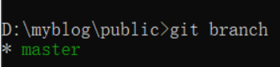
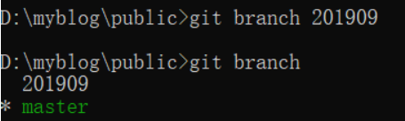
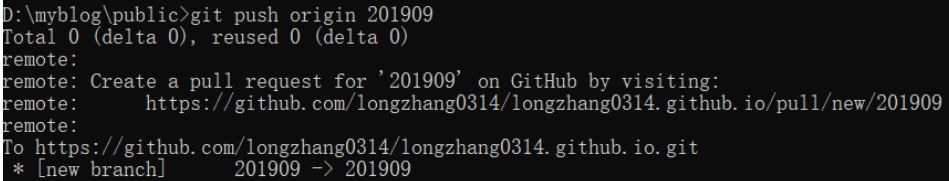

# git新建一个分支

参考：https://www.cnblogs.com/kaerxifa/p/11045573.html

1.进入本地git仓库目录，使用git branch指令，发现只有master分支

2.使用git branch 分支名来创建分支，创建完成后再次使用git branch查看，发现本地已经多出了一个新建的分支。

3. 此时远程仓库并没有这个分支，我们需要使用git push origin 分支名 命令将本地修改推送到远程服务器上。

4.push完成后就可以在远程服务上看到新建的分支了（原本是1 branches）。

