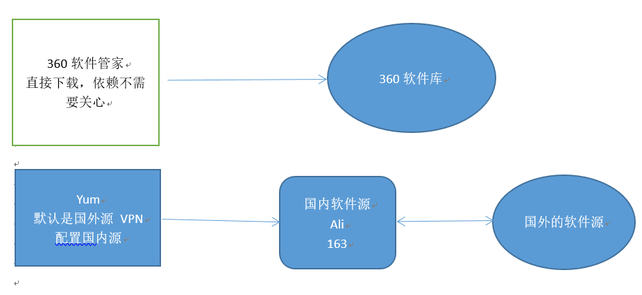

# Yum安装与配置

Yum安装与配置

介绍：

Yum（全称为 Yellow dog Updater, Modified）是一个Shell前端软件包管理器(软件)。基于RPM包管理，能够从指定的服务器自动下载RPM包并且安装，可以自动处理依赖性关系，并且一次安装所有依赖的软件包，无须繁琐地一次次下载、安装。

配置修改yum源：

1、修改配置文件

2、yum clean all 清空本地的依赖缓存

3、yum makecache 将依赖缓存下载到本地
