# linux基本命令

linux基本命令

cd: 切到某个目录下

clear:清屏

type: 查看类型，有builtin就是内部命令（shell自带的命令），否则是外部命令（用户安装的）

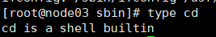

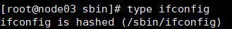

cat: 查看可执行文件内容

file: 查看文件类型

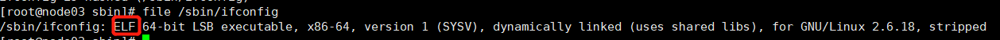

whereis: 查看某些命令可执行文件路径

echo: 打印（类似java中System.out.println）

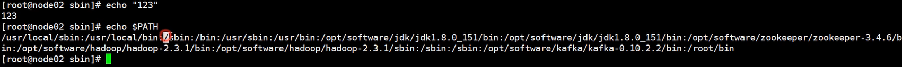

yum:包管理器

yum install:安装

man:查看外部命令帮助文档

help:查看内部命令帮助文档

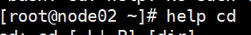

ps -ef: 任务管理器（PID:进程号）

vim:文本编辑工具（记事本）

kill -9 PID号:杀死进程

pwd:查看当前所在目录

文件系统相关的命令：

df -h:查看分区使用情况

du -h:查看文件系统的使用情况

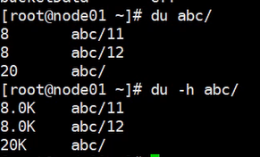

ls: 查看目录下的所有文件

ls -a：显示所有包括隐藏文件

ls -l(等于ll):显示带详细信息的文件

ll -i :可以打印出文件的id号

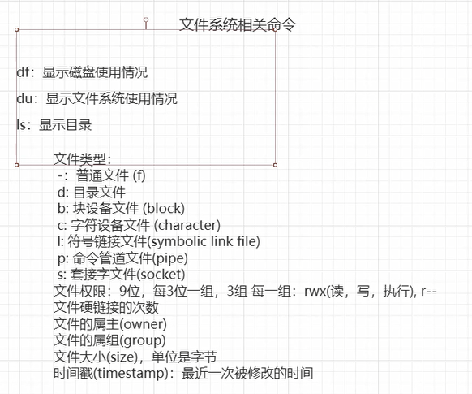

cd: 等同于cd~，回到用户目录

cd .. ：回到上层目录

mkdir：创建文件夹

mkdir -p :创建多级文件夹

一次创建多个文件夹：

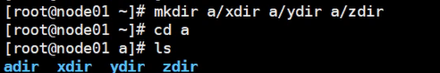

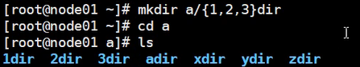

cp ：拷贝文件

cp -r ：拷贝文件夹

rm : 删除

rm -f ：强制删除

rm -r : 删除文件夹

ln （底层指向共同的文件） : 建立硬连接

ln -s （指针指向被连接的文件） :建立软连接

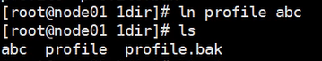

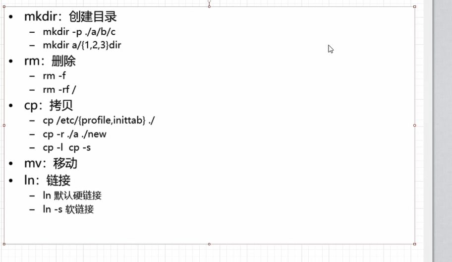

stat:查看文件的详细信息

touch:一致时间，创建新文本

cat : 显示文件所有内容

more : 显示文件一页内容，可向后翻页（无法回看）

less : 可回看，可前后翻页（内存不友好）

head:显示前10行 （可以head -5显示前5行）

tail:显示最后10行

tail -f : 显示增量数据

| ：管道，管道前面的内容是输出流，作为管道后面内容的输入流。

xargs：构建和执行一个命令行作为标准输入，管道后面无法接受管道前面的内容作为输入流时使用

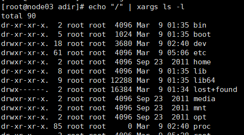

head组合tail打印第n行数据

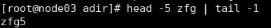

文件内命令：

enter:往下翻文件。

sapce:文件翻页。

b:向前翻页

q:退出文件。
