# 3. 配置虚拟机的网络服务

配置虚拟机的网络服务

找到网卡的位置

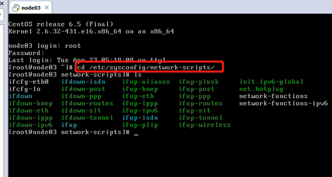

配置网卡

vi进去，按 i 进入INSERT模式开始修改，改完后esc，shift+:+wq!退出并保存

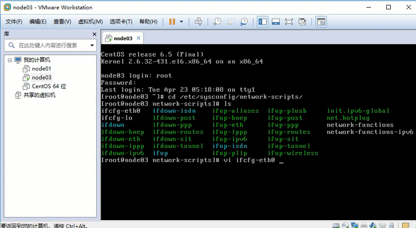

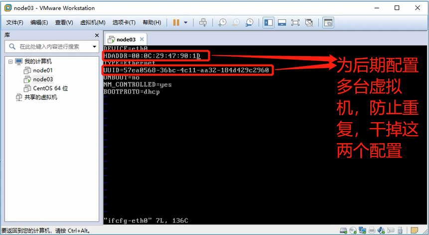

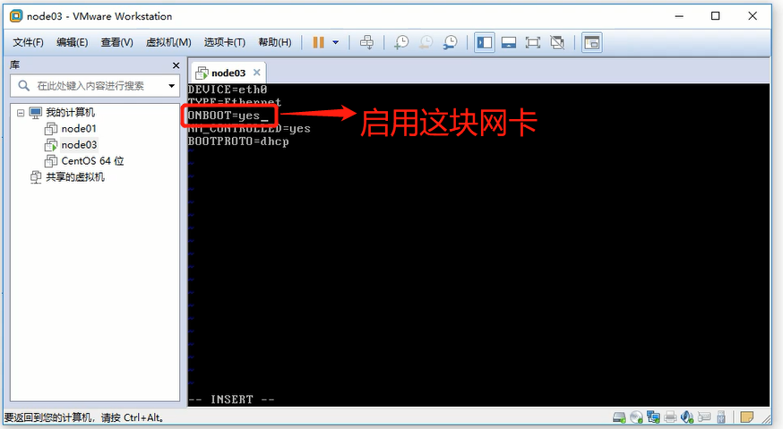

这里改为static，收到配置ip地址，方便后期克隆多台虚拟机

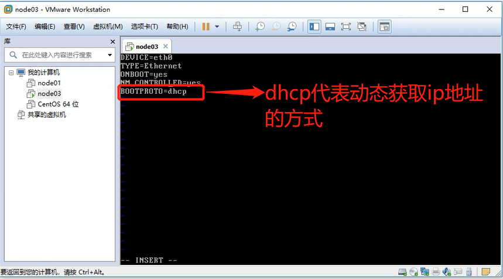

IP设置

进入查看

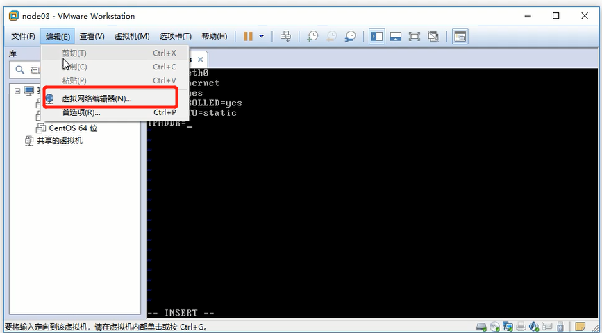

此处不一定是192.168.150的前缀，需要查看自己的电脑是多少

广播地址是255，说明可用ip是1-254

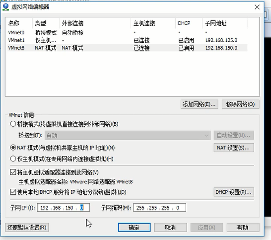

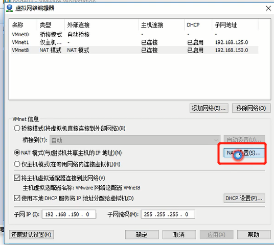

网关占用了2

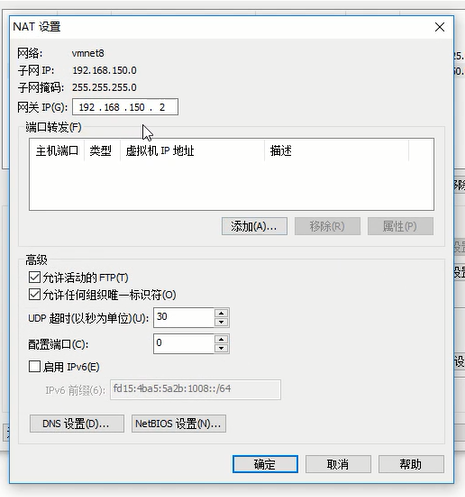

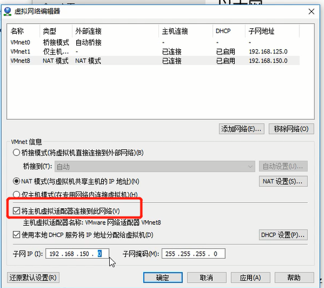

上图打钩，此处的虚拟网卡被使用

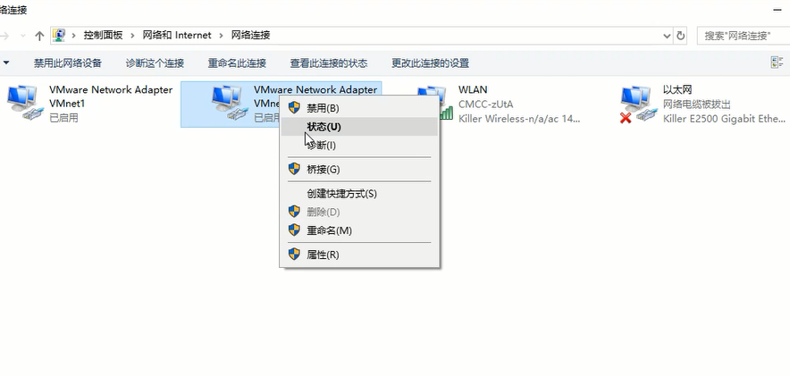

1也不能用了

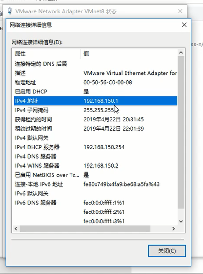

总结：0是网络号，255是广播地址，2是网关，1是虚拟网卡地址，可用地址是3-254

具体静态IP配置：

IP地址，掩码，网关，DNS

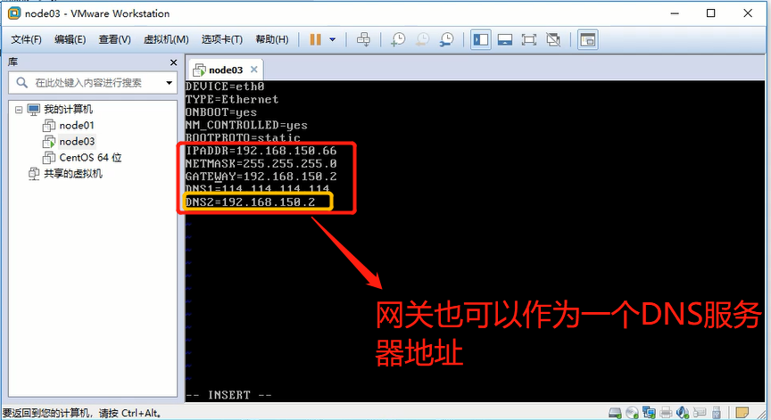

重启网卡服务

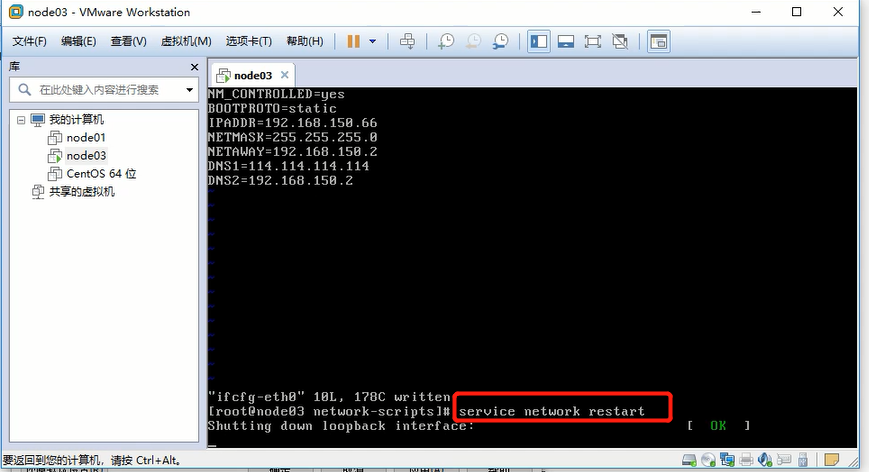

测试

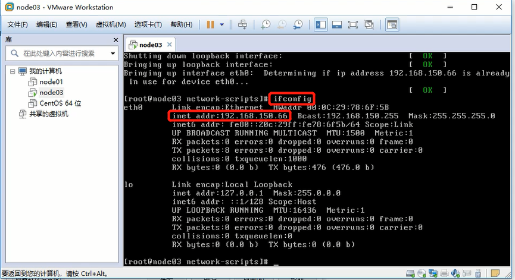

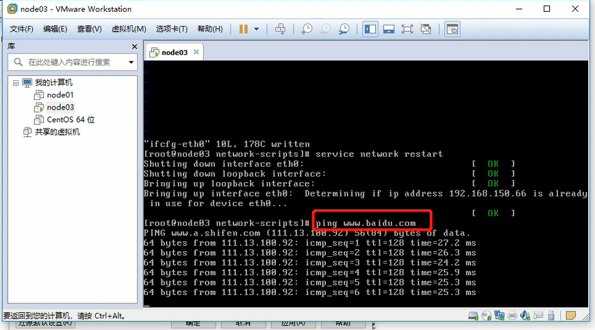

总结：

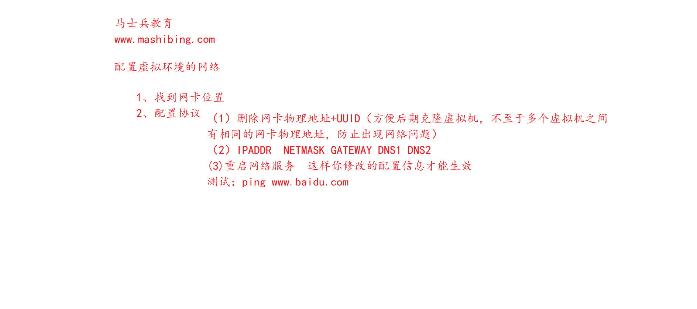
