# 4. 基于虚拟机的快照克隆多台虚拟机的方法

基于虚拟机的快照克隆多台虚拟机的方法

目的：提高配置多台虚拟机的效率

关机，目的是打快照

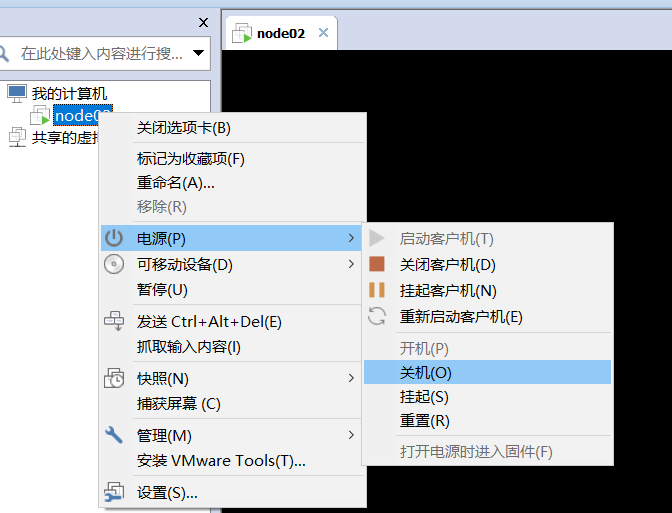

创建快照：

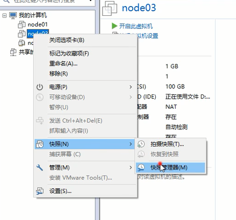

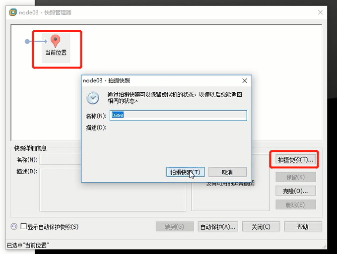

快照恢复功能（目前不用，系统出问题可以回滚）：

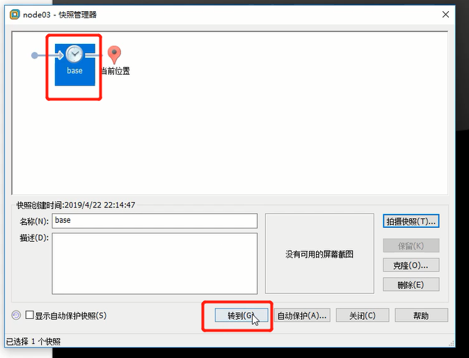

克隆快照：

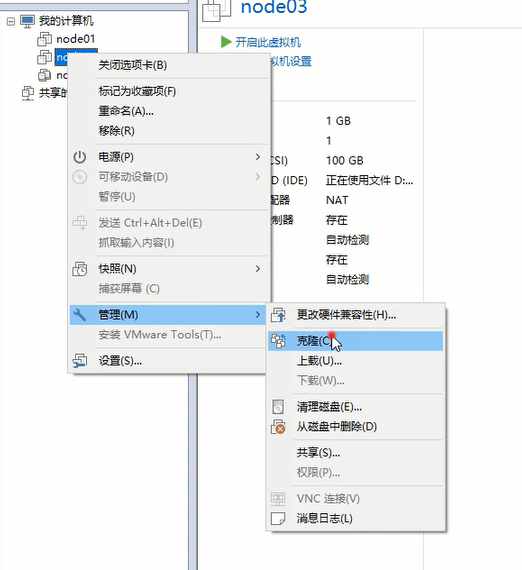

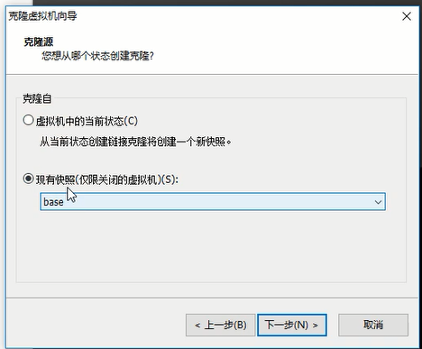

链接克隆比较快

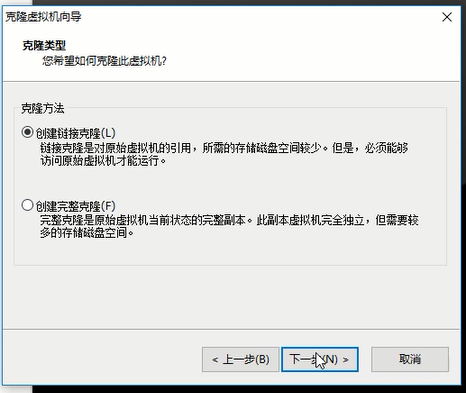

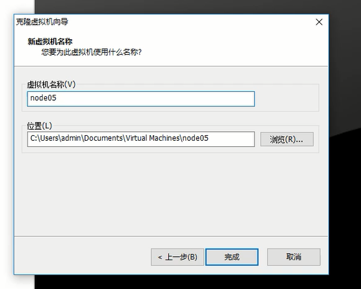

修改新克隆的配置信息：

1.修改IP

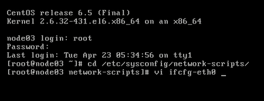

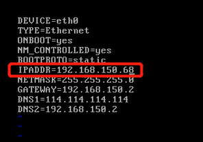

2.修改host name：

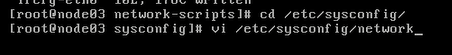

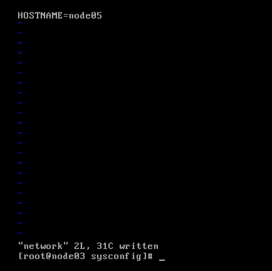

3.删除一个文件（防止克隆多台虚拟机时物理网卡一致的情况）

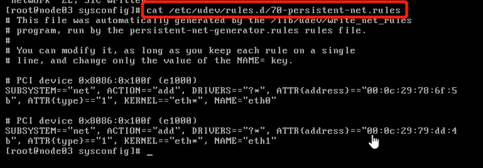

删除文件后会自动生成自己的网卡地址

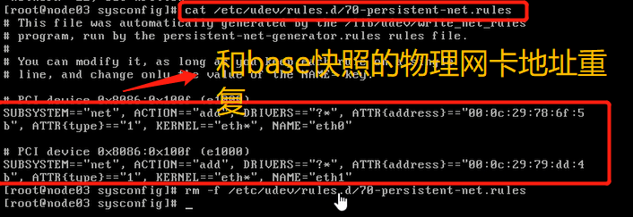

4.重启

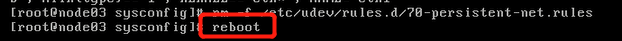

总结：

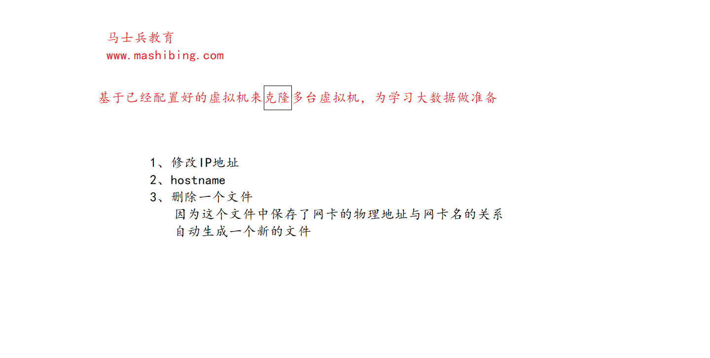
