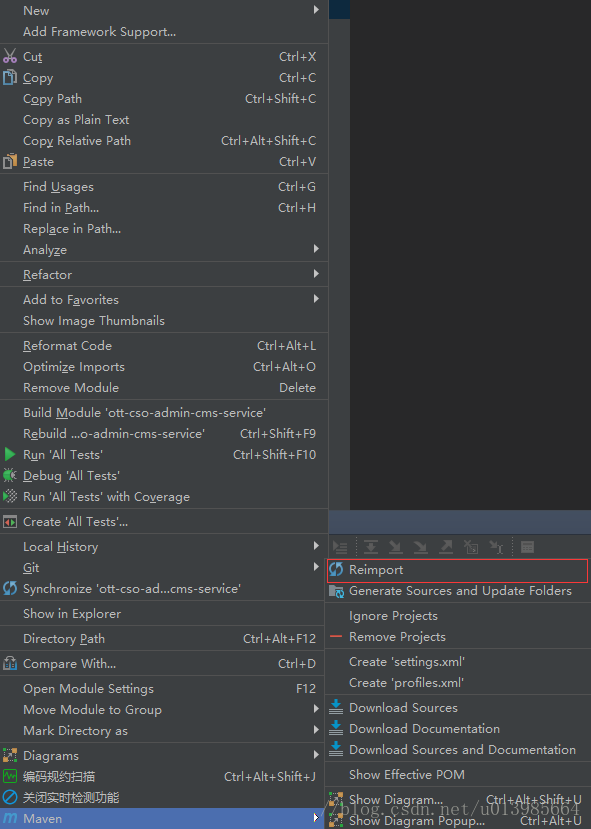
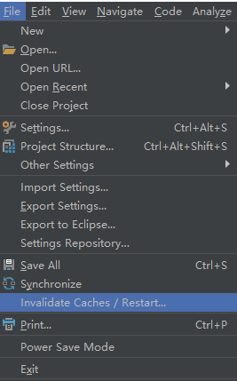
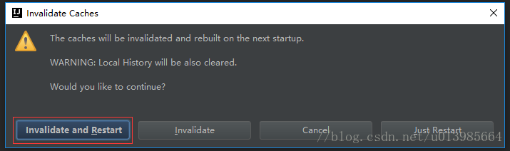
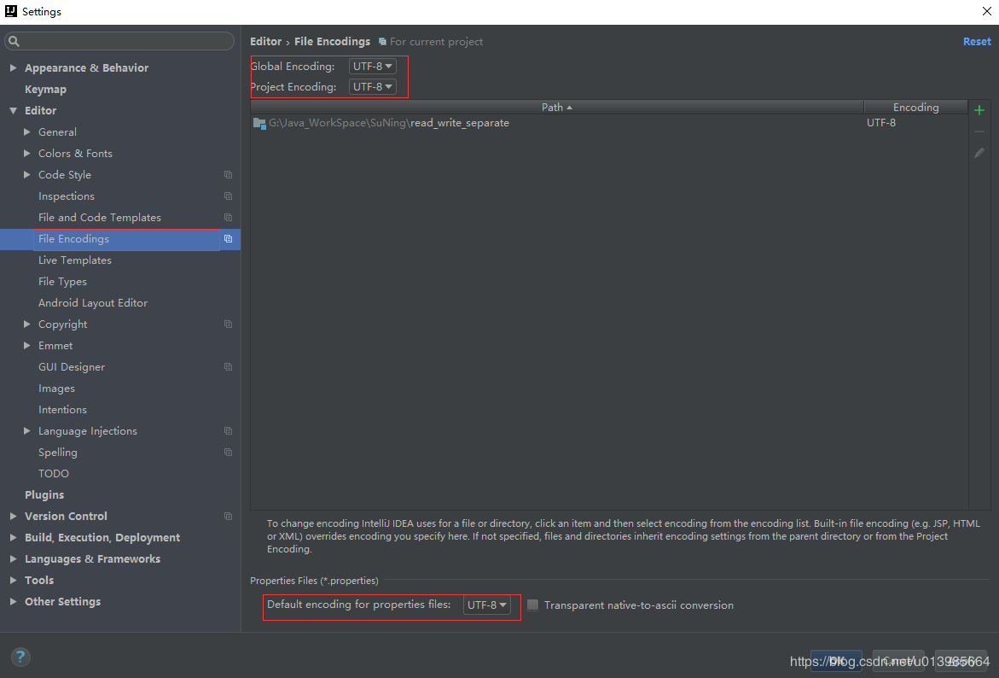
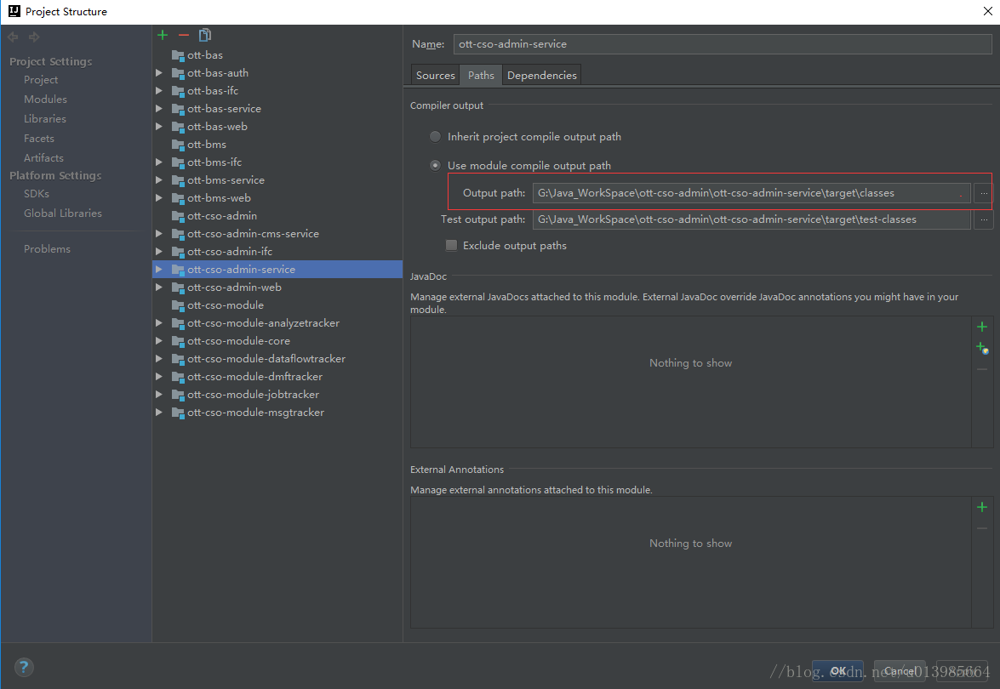
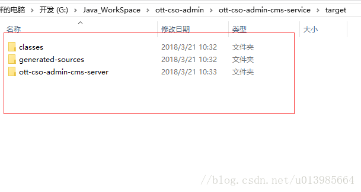
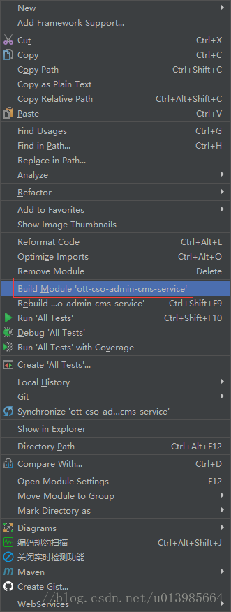

# IDEA 报错 找不到包或者找不到符号

IntelliJ IDEA 报错:找不到包或者找不到符号

2018年03月21日 10:47:54 丶从此过客 阅读数 84706

版权声明：本文为博主原创文章，遵循 CC 4.0 by-sa 版权协议，转载请附上原文出处链接和本声明。

本文链接：https://blog.csdn.net/u013985664/article/details/79636638

文章目录

7557-1566812845622IntelliJ IDEA 报错:找不到包或者找不到符号02816028#6795b5028https://blog.csdn.net/u013985664/article/details/79636638#IntelliJ_IDEA__21.5

5235-15668128456221.利用Maven-Reimport01816018#6795b5018https://blog.csdn.net/u013985664/article/details/79636638#1MavenReimport_61.5

3689-15668128456222.Invalidate and Restart02416024#6795b5024https://blog.csdn.net/u013985664/article/details/79636638#2Invalidate_and_Restart_91.5

1027-15668128456223.编码统一061606#6795b506https://blog.csdn.net/u013985664/article/details/79636638#3_131.5

9157-15668128456224.重新编译061606#6795b506https://blog.csdn.net/u013985664/article/details/79636638#4_161.5

IntelliJ IDEA 报错:找不到包或者找不到符号

 最近在使用IDEA的时候，突然出现过找不到包或者找不到符号的情况，在确定了自己引用存在的情况下，可以尝试以下几种方式来解决，以下是在开发过程中碰过问题同样解决过的几种办法,在此记录下也分享给大家，希望对各位有帮助。

1.利用Maven-Reimport

2.Invalidate and Restart

3.编码统一

4.重新编译

 点开Project Structure 找到项目编译输出目录

 将target目录下文件清空

 右键项目重新build

