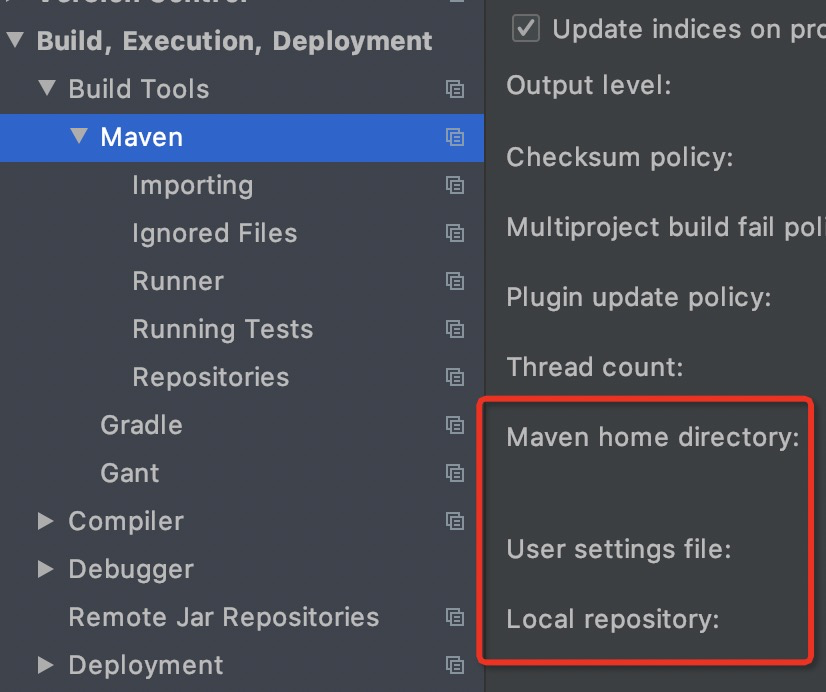
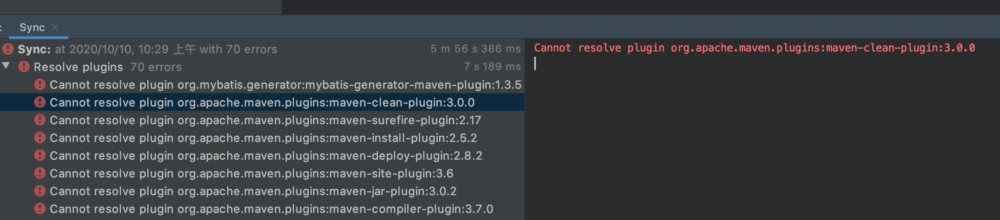
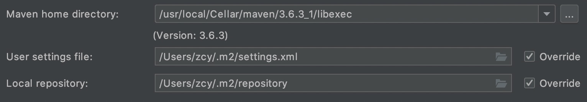

# mac新电脑配置IDEA-maven环境遇到的坑

1. mac电脑安装maven（有两种方式，最后采用第二种方式解决问题，但推测和这两种方式关系不大）：

（1）去maven官网下载安装包，然后在bash_profile配置文件配置环境变量M2_HOME和PATH；

（2）使用brew install maven安装，然后在bash_profile配置文件配置环境变量M2_HOME和PATH。

2. 安装好maven以后，在IDEA配置maven，主要配置以下3个路径；

（1）采用方法1配置：home，settings.xml，repository都配置自己下载解压的maven路径，注意settings.xml文件使用公司提供的带有私服配置的文件，其中自己配置了本地仓库地址；

使用此方法后，所有depedency都可以成功下载，项目可以启动；但是插件plugins一栏全部标红，mvn所有指令均不能正常使用，故采用方法2。

（2）采用方法2配置：home配置自己下载的maven路径（这里用的是brew install maven以后生成的路径），公司提供的settings.xml文件放入maven默认的.m2文件夹中，此处的repository路径也是默认路径。

采用此方法后结果与方法1相同，所有depedency都可以成功下载，项目可以启动；但是插件plugins一栏全部标红，mvn所有指令均不能正常使用，所以下面提供最终解决方案。

3. 最终解决

再找一个settings.xml文件，此文件不包含公司私服信息，仅在原始文件基础上配置一个阿里云镜像。将此文件放到自己下载的maven库的conf目录下。

5437-1602297879432&lt;mirror>
  &lt;id>alimaven&lt;/id>
  &lt;name>aliyun maven&lt;/name>
  &lt;url>http://maven.aliyun.com/nexus/content/groups/public/&lt;/url>
  &lt;mirrorOf>central&lt;/mirrorOf>        
&lt;/mirror>
javascriptdefault

然后问题解决，使用mvn clean等指令均可正常运行，plugins标红也自动修复了。

4. 原因分析

因为公司的maven私服仓库没有放置maven plugin包，也就是缺了一些包，这样我们没法下载到需要的全部依赖；使用上面的方法可能是因为两个settings.xml配置了不同的仓库镜像，所以maven会尝试在两个地方去遍历获取依赖。
