# 覃超面试分享

1. 有的放矢的准备

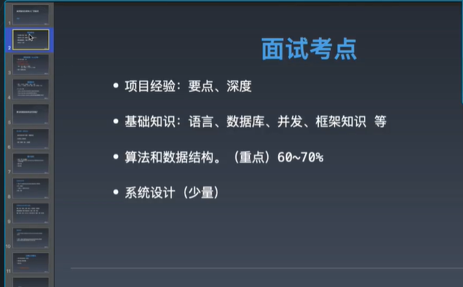

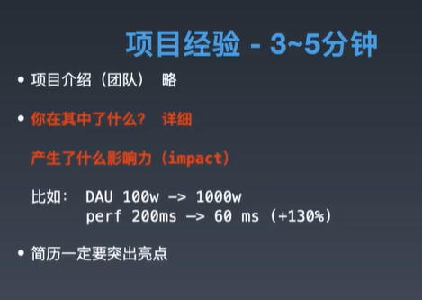

简历：

项目影响力；

代码量；

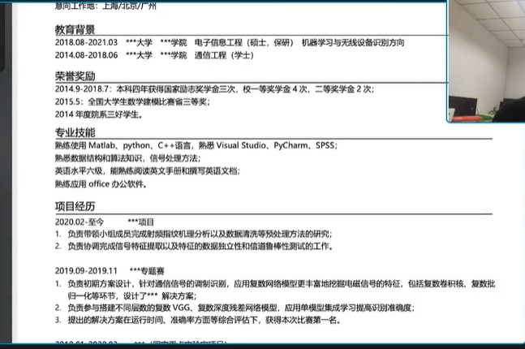

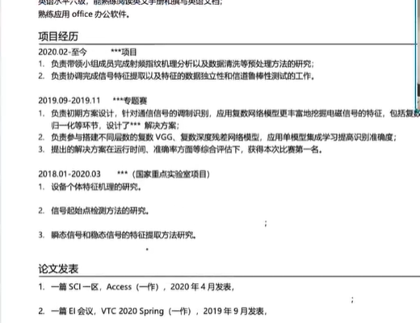

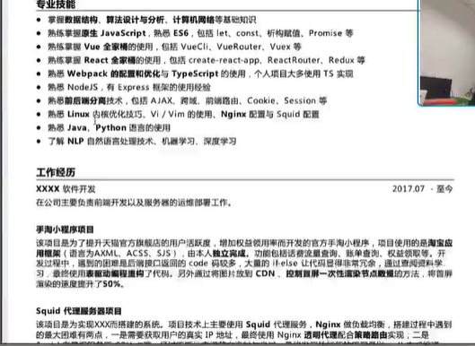

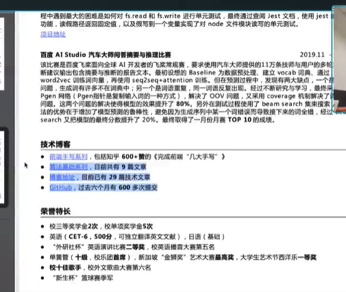

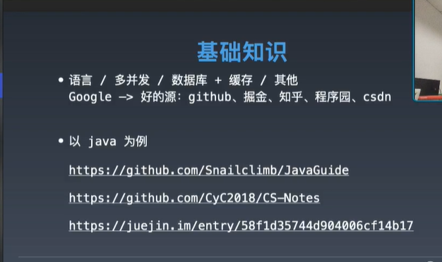

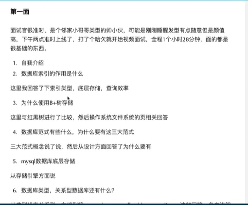

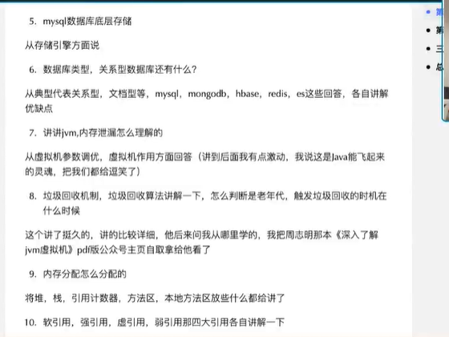

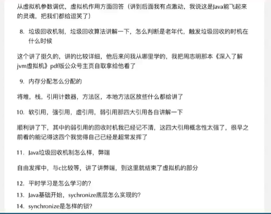

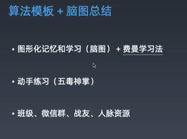

把知识体系弄成脑图；常考的点按照频次画下来；力扣，每日一题；

重点：脑图，常见题型，总结汇总，核心代码片段

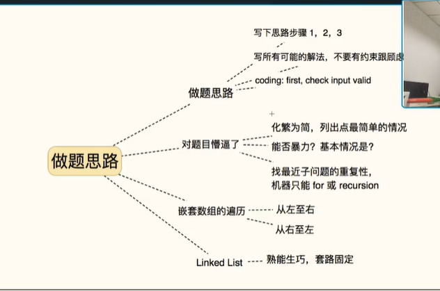

进入新公司：不要相信文档，只相信代码。

找到核心功能外层代码；

脑图软件：scapple

费曼学习法：以教为学

5分钟没思路，直接看题解；先广度优先找好的题解，再深度优先。

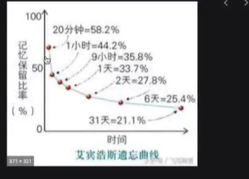

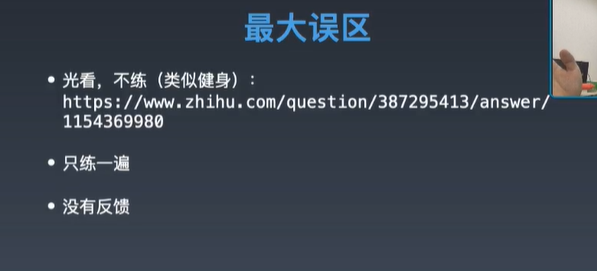

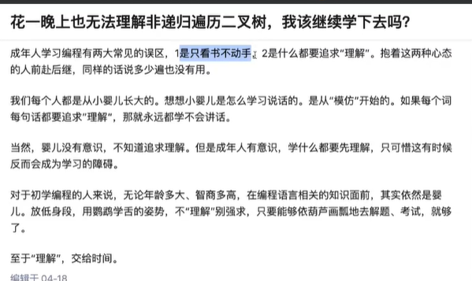

理解需要过遍数；

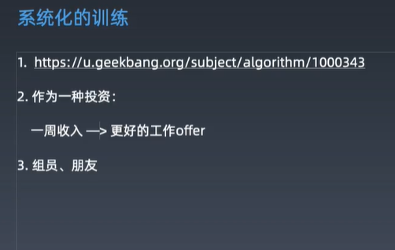

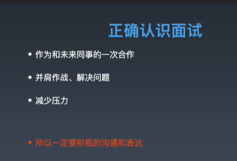

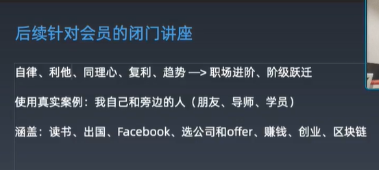
