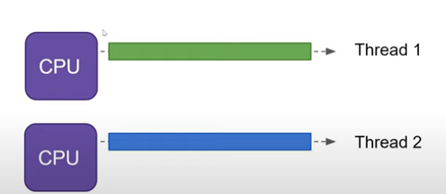
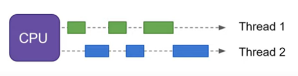
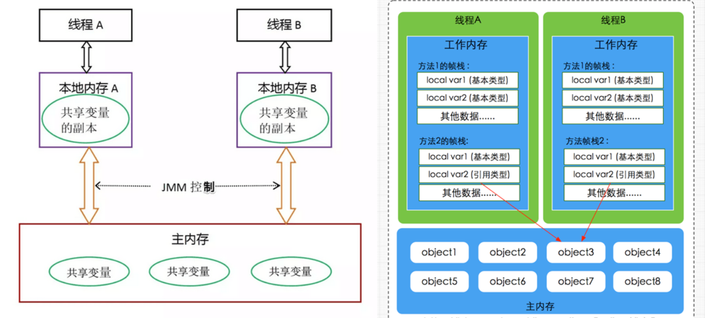
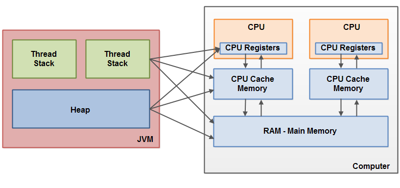
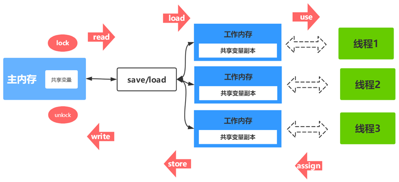
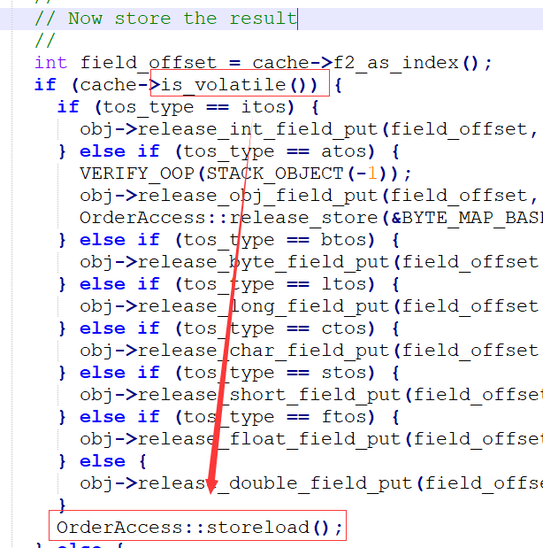
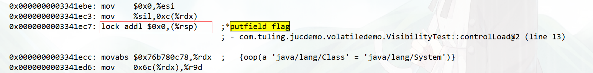
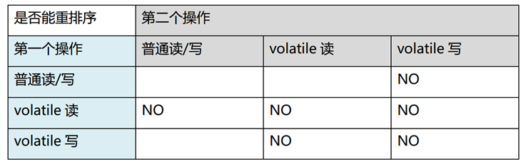
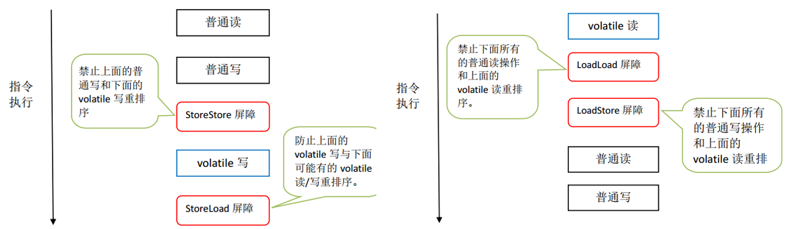
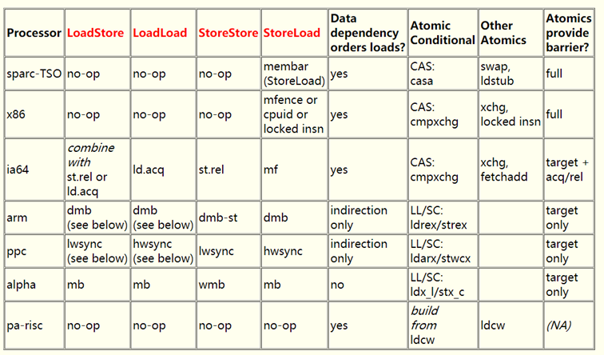

# 01-并发编程之深入理解JMM&并发三大特性（一）

有道云链接：http://note.youdao.com/noteshare?id=160fb2698c17a77af01f05e879173aab&sub=EC7C143B39E4418C8F17BF28B1572E41

课前说明：

JMM属于整个Java并发编程中最难的部分也是最重要的部分（JAVA多线程通信模型——共享内存模型），涉及的理论知识比较多，我会从三个维度去分析：

9121-1635313041514JAVA层面06#df402a

1217-1635313041514JVM层面05#df402a

1066-1635313041514硬件层面04#df402a

这块如何学？

这部分理解并发的三大特性，JMM工作内存和主内存关系，知道多线程之间如何通信的，掌握volatile能保证可见性和有序性，CAS就可以了，后续JVM层面和硬件层面的分析，基础比较薄弱的同学听不懂可以先跳过，从后面的Java锁机制课程听起，掌握常用的并发工具类，并发容器之后再来看JMM这块。

并发专题不可避免的会涉及到计算机组成原理和操作系统知识，对这块基础比较薄弱，感兴趣，想系统性学习的同学可以关注影子老师录制的计算机组成原理和操作系统课程（持续录制中）。

计算机基础系列-计算机组成原理

计算机基础系列-操作系统

9555-1635313041514并发和并行5400-1634476056232

2860-1635313041514并发三大特性16260-1634476155823

2593-1635313041514可见性26069-1634476397811

8761-1635313041514有序性25956-1634476271475

4516-1635313041514原子性23943-1634476632993

2880-1635313041514可见性问题深入分析6716-1634475799987

9798-1635313041514Java内存模型（JMM）2431-1634460514878

4841-1635313041514JMM定义14276-1634477581515

8956-1635313041514内存交互操作18380-1634459502188

3180-1635313041514JMM的内存可见性保证13556-1634470429940

6113-1635313041514volatile的内存语义11224-1634132639910

4110-1635313041514volatile的特性23555-1634132824126

1115-1635313041514volatile写-读的内存语义27131-1634133006929

4926-1635313041514volatile可见性实现原理28631-1634480757592

6119-1635313041514volatile在hotspot的实现21688-1634478846478

3537-1635313041514lock前缀指令的作用24758-1634478846478

6980-1635313041514汇编层面volatile的实现29111-1634478846478

1525-1635313041514从硬件层面分析Lock前缀指令26069-1634478949064

1886-1635313041514CPU缓存架构剖析27065-1634480383107

6180-1635313041514有序性问题深入分析17688-1634478805271

6620-1635313041514指令重排序23113-1634478576651

5051-1635313041514volatile重排序规则28394-1634706408993

6212-1635313041514JSR133规范26697-1634706423566

9770-1635313041514JVM层面的内存屏障21811-1634706407159

6191-1635313041514硬件层内存屏障25729-1634106924456

4392-1635313041514

1863-1635313041514并发和并行05true052005#3333331.43

目标都是最大化CPU的使用率

并行(parallel)：指在同一时刻，有多条指令在多个处理器上同时执行。所以无论从微观还是从宏观来看，二者都是一起执行的。

 并发(concurrency)：指在同一时刻只能有一条指令执行，但多个进程指令被快速的轮换执行，使得在宏观上具有多个进程同时执行的效果，但在微观上并不是同时执行的，只是把时间分成若干段，使多个进程快速交替的执行。

并行在多处理器系统中存在，而并发可以在单处理器和多处理器系统中都存在，并发能够在单处理器系统中存在是因为并发是并行的假象，并行要求程序能够同时执行多个操作，而并发只是要求程序假装同时执行多个操作（每个小时间片执行一个操作，多个操作快速切换执行）

4978-1635313041514并发三大特性06true0618

并发编程Bug的源头：可见性、原子性和有序性问题

3299-1635313041514可见性 04true0416

当一个线程修改了共享变量的值，其他线程能够看到修改的值。Java 内存模型是通过在变量修改后将新值同步回主内存，在变量读取前从主内存刷新变量值这种依赖主内存作为传递媒介的方法来实现可见性的。

7021-1635313041514如何保证可见性07true

8445-1635313041514通过 volatile 关键字保证可见性。

2958-1635313041514通过 内存屏障保证可见性。

7011-1635313041514通过 synchronized 关键字保证可见性。

9255-1635313041514通过 Lock保证可见性。

5664-1635313041514通过 final 关键字保证可见性

0046-1635313041514有序性03true0316

即程序执行的顺序按照代码的先后顺序执行。JVM 存在指令重排，所以存在有序性问题。

如何保证有序性

2263-1635313041514通过 volatile 关键字保证可见性。

1585-1635313041514通过 内存屏障保证可见性。

9310-1635313041514通过 synchronized关键字保证有序性。

7310-1635313041514通过 Lock保证有序性。

8870-1635313041515原子性03true0316

一个或多个操作，要么全部执行且在执行过程中不被任何因素打断，要么全部不执行。在 Java 中，对基本数据类型的变量的读取和赋值操作是原子性操作（64位处理器）。不采取任何的原子性保障措施的自增操作并不是原子性的。

7912-1635313041515如何保证原子性07true

5378-1635313041515通过 synchronized 关键字保证原子性。

2613-1635313041515通过 Lock保证原子性。

3322-1635313041515通过 CAS保证原子性。

思考：在 32 位的机器上对 long 型变量进行加减操作是否存在并发隐患？

https://docs.oracle.com/javase/specs/jls/se8/html/jls-17.html#jls-17.7

7055-1635313041515

6056-1635313041515可见性问题深入分析09true0920

我们通过下面的Java小程序来分析Java的多线程可见性的问题

2173-1635313041515/**
 * @author Fox
 *
 * -XX:+UnlockDiagnosticVMOptions -XX:+PrintAssembly -Xcomp
 */
public class VisibilityTest &#123;

    private boolean flag = true;

    public void refresh() &#123;
        flag = false;
        System.out.println(Thread.currentThread().getName() + "修改flag");
    &#125;

    public void load() &#123;
        System.out.println(Thread.currentThread().getName() + "开始执行.....");
        int i = 0;
        while (flag) &#123;
            i++;
            //TODO  业务逻辑

        &#125;
        System.out.println(Thread.currentThread().getName() + "跳出循环: i=" + i);
    &#125;

    public static void main(String[] args) throws InterruptedException &#123;
        VisibilityTest test = new VisibilityTest();

        // 线程threadA模拟数据加载场景
        Thread threadA = new Thread(() -> test.load(), "threadA");
        threadA.start();

        // 让threadA执行一会儿
        Thread.sleep(1000);
        // 线程threadB通过flag控制threadA的执行时间
        Thread threadB = new Thread(() -> test.refresh(), "threadB");
        threadB.start();

    &#125;

    public static void shortWait(long interval) &#123;
        long start = System.nanoTime();
        long end;
        do &#123;
            end = System.nanoTime();
        &#125; while (start + interval >= end);
    &#125;
&#125;javadefault

思考：上面例子中为什么多线程对共享变量的操作存在可见性问题？

3341-1635313041515

2240-1635313041515Java内存模型（JMM）013true01320

9228-1635313041515JMM定义05true0518

Java虚拟机规范中定义了Java内存模型（Java Memory Model，JMM），用于屏蔽掉各种硬件和操作系统的内存访问差异，以实现让Java程序在各种平台下都能达到一致的并发效果，JMM规范了Java虚拟机与计算机内存是如何协同工作的：规定了一个线程如何和何时可以看到由其他线程修改过后的共享变量的值，以及在必须时如何同步的访问共享变量。JMM描述的是一种抽象的概念，一组规则，通过这组规则控制程序中各个变量在共享数据区域和私有数据区域的访问方式，JMM是围绕原子性、有序性、可见性展开的。

JMM与硬件内存架构的关系

Java内存模型与硬件内存架构之间存在差异。硬件内存架构没有区分线程栈和堆。对于硬件，所有的线程栈和堆都分布在主内存中。部分线程栈和堆可能有时候会出现在CPU缓存中和CPU内部的寄存器中。如下图所示，Java内存模型和计算机硬件内存架构是一个交叉关系：

3063-1635313041515内存交互操作06true0618

关于主内存与工作内存之间的具体交互协议，即一个变量如何从主内存拷贝到工作内存、如何从工作内存同步到主内存之间的实现细节，Java内存模型定义了以下八种操作来完成：

3277-1635313041515lock（锁定）：作用于主内存的变量，把一个变量标识为一条线程独占状态。

4550-1635313041515unlock（解锁）：作用于主内存变量，把一个处于锁定状态的变量释放出来，释放后的变量才可以被其他线程锁定。

9670-1635313041515read（读取）：作用于主内存变量，把一个变量值从主内存传输到线程的工作内存中，以便随后的load动作使用

1752-1635313041515load（载入）：作用于工作内存的变量，它把read操作从主内存中得到的变量值放入工作内存的变量副本中。

3628-1635313041515use（使用）：作用于工作内存的变量，把工作内存中的一个变量值传递给执行引擎，每当虚拟机遇到一个需要使用变量的值的字节码指令时将会执行这个操作。

7048-1635313041515assign（赋值）：作用于工作内存的变量，它把一个从执行引擎接收到的值赋值给工作内存的变量，每当虚拟机遇到一个给变量赋值的字节码指令时执行这个操作。

1298-1635313041515store（存储）：作用于工作内存的变量，把工作内存中的一个变量的值传送到主内存中，以便随后的write的操作。

8099-1635313041515write（写入）：作用于主内存的变量，它把store操作从工作内存中一个变量的值传送到主内存的变量中。

Java内存模型还规定了在执行上述八种基本操作时，必须满足如下规则：

5040-1635313041515如果要把一个变量从主内存中复制到工作内存，就需要按顺寻地执行read和load操作， 如果把变量从工作内存中同步回主内存中，就要按顺序地执行store和write操作。但Java内存模型只要求上述操作必须按顺序执行，而没有保证必须是连续执行。85121#df402a

7443-1635313041515不允许read和load、store和write操作之一单独出现

6167-1635313041515不允许一个线程丢弃它的最近assign的操作，即变量在工作内存中改变了之后必须同步到主内存中。

5320-1635313041515不允许一个线程无原因地（没有发生过任何assign操作）把数据从工作内存同步回主内存中。

7216-1635313041515一个新的变量只能在主内存中诞生，不允许在工作内存中直接使用一个未被初始化（load或assign）的变量。即就是对一个变量实施use和store操作之前，必须先执行过了assign和load操作。

3814-1635313041515一个变量在同一时刻只允许一条线程对其进行lock操作，但lock操作可以被同一条线程重复执行多次，多次执行lock后，只有执行相同次数的unlock操作，变量才会被解锁。lock和unlock必须成对出现

1339-1635313041515如果对一个变量执行lock操作，将会清空工作内存中此变量的值，在执行引擎使用这个变量前需要重新执行load或assign操作初始化变量的值069#df402a

9632-1635313041515如果一个变量事先没有被lock操作锁定，则不允许对它执行unlock操作；也不允许去unlock一个被其他线程锁定的变量。

5889-1635313041515对一个变量执行unlock操作之前，必须先把此变量同步到主内存中（执行store和write操作）。050#df402a

8440-1635313041515JMM的内存可见性保证011true01118

按程序类型，Java程序的内存可见性保证可以分为下列3类：

7373-1635313041515单线程程序。单线程程序不会出现内存可见性问题。编译器、runtime和处理器会共同确保单线程程序的执行结果与该程序在顺序一致性模型中的执行结果相同。06#df402a

4070-1635313041515正确同步的多线程程序。正确同步的多线程程序的执行将具有顺序一致性（程序的执行结果与该程序在顺序一致性内存模型中的执行结果相同）。这是JMM关注的重点，JMM通过限制编译器和处理器的重排序来为程序员提供内存可见性保证。011#df402a

6395-1635313041515未同步/未正确同步的多线程程序。JMM为它们提供了最小安全性保障：线程执行时读取到的值，要么是之前某个线程写入的值，要么是默认值未同步程序在JMM中的执行时，整体上是无序的，其执行结果无法预知。 JMM不保证未同步程序的执行结果与该程序在顺序一致性模型中的执行结果一致。016#df402a98135#df402a

未同步程序在JMM中的执行时，整体上是无序的，其执行结果无法预知。未同步程序在两个模型中的执行特性有如下几个差异。

1）顺序一致性模型保证单线程内的操作会按程序的顺序执行，而JMM不保证单线程内的操作会按程序的顺序执行，比如正确同步的多线程程序在临界区内的重排序。

2）顺序一致性模型保证所有线程只能看到一致的操作执行顺序，而JMM不保证所有线程能看到一致的操作执行顺序。

3）顺序一致性模型保证对所有的内存读/写操作都具有原子性，而JMM不保证对64位的long型和double型变量的写操作具有原子性（32位处理器）。

5089-1635313041515JVM在32位处理器上运行时，可能会把一个64位long/double型变量的写操作拆分为两个32位的写操作来执行。这两个32位的写操作可能会被分配到不同的总线事务中执行，此时对这个64位变量的写操作将不具有原子性。从JSR-133内存模型开始（即从JDK5开始），仅仅只允许把一个64位long/double型变量的写操作拆分为两个32位的写操作来执行，任意的读操作在JSR-133中都必须具有原子性

3263-1635313041515volatile的内存语义013true01318

5934-1635313041515volatile的特性011true01116

8028-1635313041515可见性：对一个volatile变量的读，总是能看到（任意线程）对这个volatile变量最后的写入。050#df402a

4075-1635313041515原子性：对任意单个volatile变量的读/写具有原子性，但类似于volatile++这种复合操作不具有原子性（基于这点，我们通过会认为volatile不具备原子性）。volatile仅仅保证对单个volatile变量的读/写具有原子性，而锁的互斥执行的特性可以确保对整个临界区代码的执行具有原子性。 055#df402a

2078-163531304151564位的long型和double型变量，只要它是volatile变量，对该变量的读/写就具有原子性。

5296-1635313041515有序性：对volatile修饰的变量的读写操作前后加上各种特定的内存屏障来禁止指令重排序来保障有序性。051#df402a

8253-1635313041515在JSR-133之前的旧Java内存模型中，虽然不允许volatile变量之间重排序，但旧的Java内存模型允许volatile变量与普通变量重排序。为了提供一种比锁更轻量级的线程之间通信的机制，JSR-133专家组决定增强volatile的内存语义：严格限制编译器和处理器对volatile变量与普通变量的重排序，确保volatile的写-读和锁的释放-获取具有相同的内存语义。98190#df402a

8963-1635313041515volatile写-读的内存语义016true01616

7417-1635313041515当写一个volatile变量时，JMM会把该线程对应的本地内存中的共享变量值刷新到主内存。045#df402a

9725-1635313041515当读一个volatile变量时，JMM会把该线程对应的本地内存置为无效，线程接下来将从主内存中读取共享变量。054#df402a

6443-1635313041515volatile可见性实现原理015true01516

8954-1635313190883JMM内存交互层面实现011true

volatile修饰的变量的read、load、use操作和assign、store、write必须是连续的，即修改后必须立即同步回主内存，使用时必须从主内存刷新，由此保证volatile变量操作对多线程的可见性。

1160-1635313041515硬件层面实现06true

通过lock前缀指令，会锁定变量缓存行区域并写回主内存，这个操作称为“缓存锁定”，缓存一致性机制会阻止同时修改被两个以上处理器缓存的内存区域数据。一个处理器的缓存回写到内存会导致其他处理器的缓存无效。

5030-1635313041515volatile在hotspot的实现019true01916

6228-1635313041515字节码解释器实现08true

JVM中的字节码解释器(bytecodeInterpreter)，用C++实现了JVM指令，其优点是实现相对简单且容易理解，缺点是执行慢。

bytecodeInterpreter.cpp

5854-1635313041515模板解释器实现07true07#32323207#ffffff

模板解释器(templateInterpreter)，其对每个指令都写了一段对应的汇编代码，启动时将每个指令与对应汇编代码入口绑定，可以说是效率做到了极致。

templateTable_x86_64.cpp

3923-1635313041515void TemplateTable::volatile_barrier(Assembler::Membar_mask_bits
                                     order_constraint) &#123;
  // Helper function to insert a is-volatile test and memory barrier
  if (os::is_MP()) &#123; // Not needed on single CPU
    __ membar(order_constraint);
  &#125;
&#125;

// 负责执行putfield或putstatic指令
void TemplateTable::putfield_or_static(int byte_no, bool is_static, RewriteControl rc) &#123;
	// ...
	 // Check for volatile store
    __ testl(rdx, rdx);
    __ jcc(Assembler::zero, notVolatile);

    putfield_or_static_helper(byte_no, is_static, rc, obj, off, flags);
    volatile_barrier(Assembler::Membar_mask_bits(Assembler::StoreLoad |
                                                 Assembler::StoreStore));
    __ jmp(Done);
    __ bind(notVolatile);

    putfield_or_static_helper(byte_no, is_static, rc, obj, off, flags);

    __ bind(Done);
 &#125;
javadefault

assembler_x86.hpp

5253-1635313041515  // Serializes memory and blows flags
  void membar(Membar_mask_bits order_constraint) &#123;
    // We only have to handle StoreLoad
    // x86平台只需要处理StoreLoad
    if (order_constraint & StoreLoad) &#123;

      int offset = -VM_Version::L1_line_size();
      if (offset &lt; -128) &#123;
        offset = -128;
      &#125;

      // 下面这两句插入了一条lock前缀指令: lock addl $0, $0(%rsp) 
      lock(); // lock前缀指令
      addl(Address(rsp, offset), 0); // addl $0, $0(%rsp) 
    &#125;
  &#125;
javadefault

3029-1635313041515在linux系统x86中的实现015true

orderAccess_linux_x86.inline.hpp

6884-1635313041515inline void OrderAccess::storeload()  &#123; fence(); &#125;
inline void OrderAccess::fence() &#123;
  if (os::is_MP()) &#123;
    // always use locked addl since mfence is sometimes expensive
#ifdef AMD64
    __asm__ volatile ("lock; addl $0,0(%%rsp)" : : : "cc", "memory");
#else
    __asm__ volatile ("lock; addl $0,0(%%esp)" : : : "cc", "memory");
#endif
  &#125;
&#125;javadefault

x86处理器中利用lock实现类似内存屏障的效果。

7073-1635313041515lock前缀指令的作用011true01116

1. 确保后续指令执行的原子性。在Pentium及之前的处理器中，带有lock前缀的指令在执行期间会锁住总线，使得其它处理器暂时无法通过总线访问内存，很显然，这个开销很大。在新的处理器中，Intel使用缓存锁定来保证指令执行的原子性，缓存锁定将大大降低lock前缀指令的执行开销。

2. LOCK前缀指令具有类似于内存屏障的功能，禁止该指令与前面和后面的读写指令重排序。

3. LOCK前缀指令会等待它之前所有的指令完成、并且所有缓冲的写操作写回内存(也就是将store buffer中的内容写入内存)之后才开始执行，并且根据缓存一致性协议，刷新store buffer的操作会导致其他cache中的副本失效。

0042-1635313041523汇编层面volatile的实现015true01516

添加下面的jvm参数查看之前可见性Demo的汇编指令

3717-1635313041523-XX:+UnlockDiagnosticVMOptions -XX:+PrintAssembly -Xcompjavadefault

验证了可见性使用了lock前缀指令

5387-1635313041523从硬件层面分析Lock前缀指令015true01516

《64-ia-32-architectures-software-developer-vol-3a-part-1-manual.pdf》中有如下描述：

3831-1635313041523The 32-bit IA-32 processors support locked atomic operations on locations in system memory. These operations are typically used to manage shared data structures (such as semaphores, segment descriptors, system segments, or page tables) in which two or more processors may try simultaneously to modify the same field or flag. The processor uses three interdependent mechanisms for carrying out locked atomic operations:

2097-1635313041523• Guaranteed atomic operations

1544-1635313041523• Bus locking, using the LOCK# signal and the LOCK instruction prefix

3043-1635313041523• Cache coherency protocols that ensure that atomic operations can be carried out on cached data structures (cache lock); this mechanism is present in the Pentium 4, Intel Xeon, and P6 family processors

32位的IA-32处理器支持对系统内存中的位置进行锁定的原子操作。这些操作通常用于管理共享的数据结构(如信号量、段描述符、系统段或页表)，在这些结构中，两个或多个处理器可能同时试图修改相同的字段或标志。处理器使用三种相互依赖的机制来执行锁定的原子操作:

7224-1635313041523有保证的原子操作

2381-1635313041523总线锁定，使用LOCK#信号和LOCK指令前缀

7749-1635313041523缓存一致性协议，确保原子操作可以在缓存的数据结构上执行(缓存锁);这种机制出现在Pentium 4、Intel Xeon和P6系列处理器中

6512-1635313041523CPU缓存架构剖析09true0916

笔记

8862-1635313041524

7425-1635313041524有序性问题深入分析09true0918

思考：下面的Java程序中x和y的最终结果是什么？

6449-1635313041524public class ReOrderTest &#123;

    private static int x = 0, y = 0;

    private static  int a = 0, b = 0;

    public static void main(String[] args) throws InterruptedException&#123;
        int i=0;
        while (true) &#123;
            i++;
            x = 0;
            y = 0;
            a = 0;
            b = 0;

            /**
             *  x,y:
             */
            Thread thread1 = new Thread(new Runnable() &#123;
                @Override
                public void run() &#123;
                    shortWait(20000);
                    a = 1;
                    x = b;

                &#125;
            &#125;);
            Thread thread2 = new Thread(new Runnable() &#123;
                @Override
                public void run() &#123;
                    b = 1;
                    y = a;
                &#125;
            &#125;);

            thread1.start();
            thread2.start();
            thread1.join();
            thread2.join();

            System.out.println("第" + i + "次（" + x + "," + y + ")");

            if (x==0&&y==0)&#123;
                break;
            &#125;

        &#125;

    &#125;

    public static void shortWait(long interval)&#123;
        long start = System.nanoTime();
        long end;
        do&#123;
            end = System.nanoTime();
        &#125;while(start + interval >= end);
    &#125;
&#125;javadefault

9587-1635313041524指令重排序05true0520

Java语言规范规定JVM线程内部维持顺序化语义。即只要程序的最终结果与它顺序化情况的结果相等，那么指令的执行顺序可以与代码顺序不一致，此过程叫指令的重排序。

指令重排序的意义：JVM能根据处理器特性（CPU多级缓存系统、多核处理器等）适当的对机器指令进行重排序，使机器指令能更符合CPU的执行特性，最大限度的发挥机器性能。

在编译器与CPU处理器中都能执行指令重排优化操作

5897-1635313041524volatile重排序规则013true01316

volatile禁止重排序场景：

1.  第二个操作是volatile写，不管第一个操作是什么都不会重排序

2.  第一个操作是volatile读，不管第二个操作是什么都不会重排序

3.  第一个操作是volatile写，第二个操作是volatile读，也不会发生重排序

JMM内存屏障插入策略

1. 在每个volatile写操作的前面插入一个StoreStore屏障

2. 在每个volatile写操作的后面插入一个StoreLoad屏障

3. 在每个volatile读操作的后面插入一个LoadLoad屏障

4. 在每个volatile读操作的后面插入一个LoadStore屏障

3143-1635313041524

2818-1635313041524JSR133规范08true0816

9314-1635313041524https://note.youdao.com/yws/public/resource/07a6a311bdce85e7dbf5756210ae05d2/xmlnote/514E2167F6164C358E6FB1766ED36831/9B2DB420A2BB492E980F64E2BB52F6EA/10938https://note.youdao.com/yws/public/resource/07a6a311bdce85e7dbf5756210ae05d2/xmlnote/514E2167F6164C358E6FB1766ED36831/9999AEA6CE2D4A509C39D5A5B4A690DE/10936The JSR-133 Cookbook.html50884

x86处理器不会对读-读、读-写和写-写操作做重排序, 会省略掉这3种操作类型对应的内存屏障。仅会对写-读操作做重排序，所以volatile写-读操作只需要在volatile写后插入StoreLoad屏障

2500-1635313041524

3238-1635313041524

2344-1635313041524JVM层面的内存屏障010true01016

在JSR规范中定义了4种内存屏障：

LoadLoad屏障：（指令Load1; LoadLoad; Load2），在Load2及后续读取操作要读取的数据被访问前，保证Load1要读取的数据被读取完毕。

LoadStore屏障：（指令Load1; LoadStore; Store2），在Store2及后续写入操作被刷出前，保证Load1要读取的数据被读取完毕。

StoreStore屏障：（指令Store1; StoreStore; Store2），在Store2及后续写入操作执行前，保证Store1的写入操作对其它处理器可见。

StoreLoad屏障：（指令Store1; StoreLoad; Load2），在Load2及后续所有读取操作执行前，保证Store1的写入对所有处理器可见。它的开销是四种屏障中最大的。在大多数处理器的实现中，这个屏障是个万能屏障，兼具其它三种内存屏障的功能

由于x86只有store load可能会重排序，所以只有JSR的StoreLoad屏障对应它的mfence或lock前缀指令，其他屏障对应空操作

9914-1635313041524硬件层内存屏障07true0716

硬件层提供了一系列的内存屏障 memory barrier / memory fence(Intel的提法)来提供一致性的能力。拿X86平台来说，有几种主要的内存屏障：

1. lfence，是一种Load Barrier 读屏障

2. sfence, 是一种Store Barrier 写屏障

3. mfence, 是一种全能型的屏障，具备lfence和sfence的能力

4. Lock前缀，Lock不是一种内存屏障，但是它能完成类似内存屏障的功能。Lock会对CPU总线和高速缓存加锁，可以理解为CPU指令级的一种锁。它后面可以跟ADD, ADC, AND, BTC, BTR, BTS, CMPXCHG, CMPXCH8B, DEC, INC, NEG, NOT, OR, SBB, SUB, XOR, XADD, and XCHG等指令。

内存屏障有两个能力：

1. 阻止屏障两边的指令重排序

2. 刷新处理器缓存/冲刷处理器缓存

对Load Barrier来说，在读指令前插入读屏障，可以让高速缓存中的数据失效，重新从主内存加载数据；对Store Barrier来说，在写指令之后插入写屏障，能让写入缓存的最新数据写回到主内存。

Lock前缀实现了类似的能力，它先对总线和缓存加锁，然后执行后面的指令，最后释放锁后会把高速缓存中的数据刷新回主内存。在Lock锁住总线的时候，其他CPU的读写请求都会被阻塞，直到锁释放。

不同硬件实现内存屏障的方式不同，Java内存模型屏蔽了这种底层硬件平台的差异，由JVM来为不同的平台生成相应的机器码。
