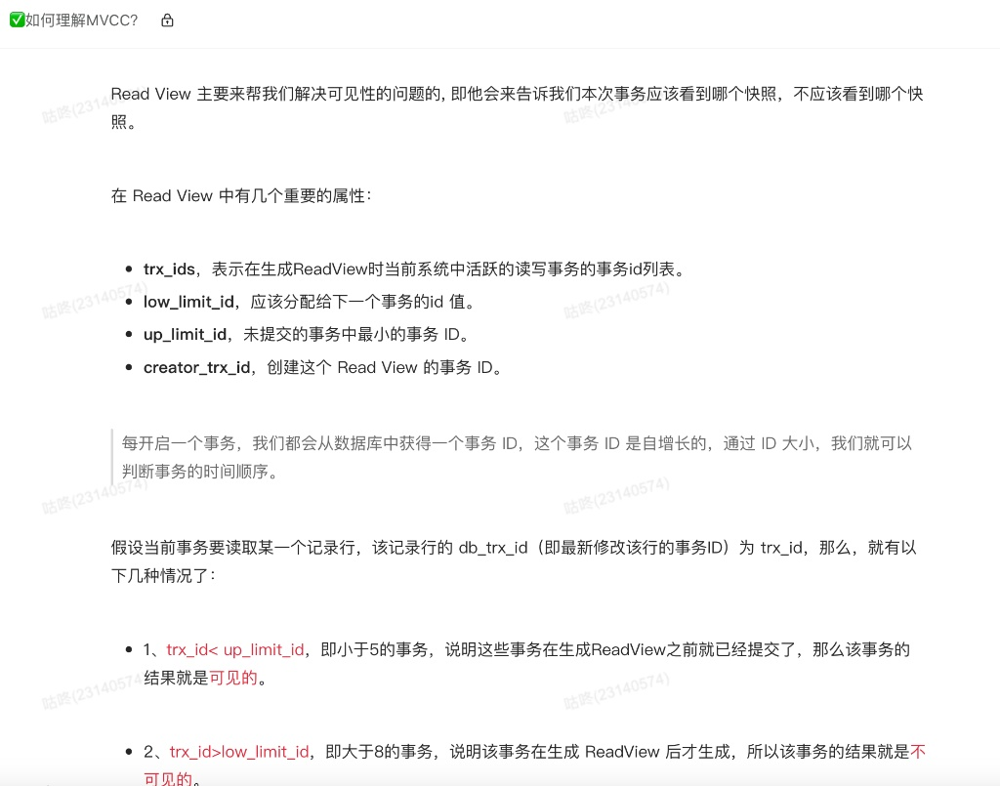
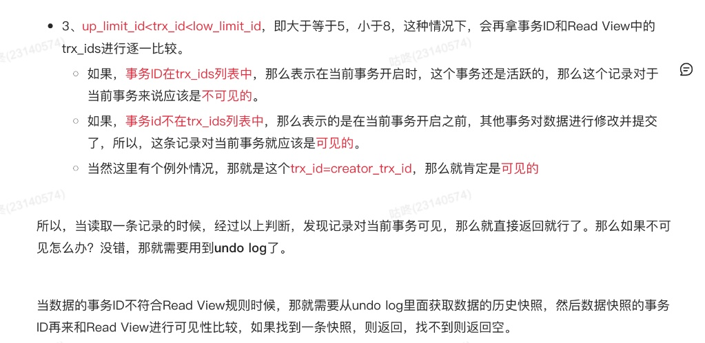
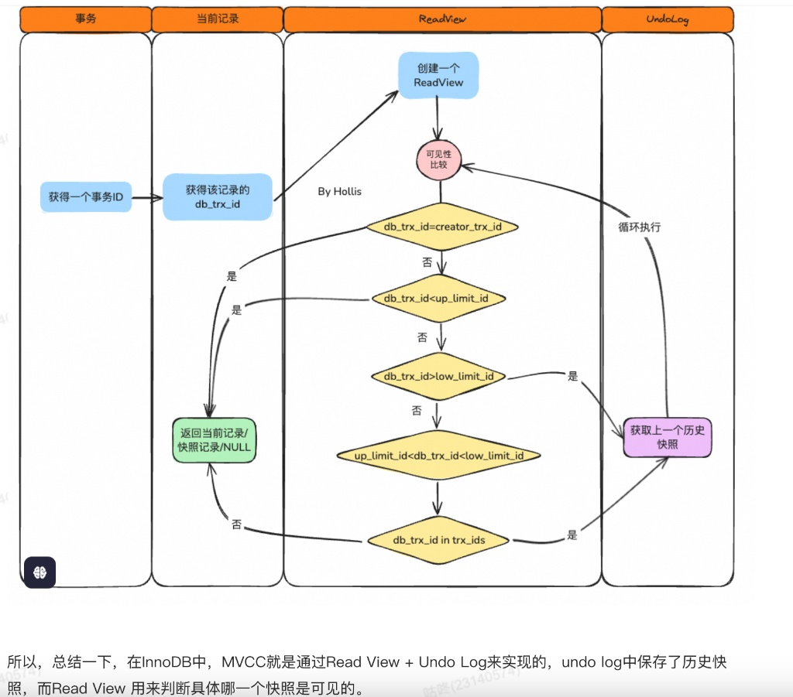

# 如何理解MVCC中的ReadView

亮哥的文章中是这么写的，完全摘抄

更通俗的解释是这样的

理解 MVCC（多版本并发控制）就像是在看一场电影的剪辑过程。

数据库里的每一行数据，并不是只有一个当前状态，而是拖着一条长长的“历史阴影”（Undo Log）。Read View 就是一张入场券，它决定了你能看到这部电影的哪个片段。

我们把复杂的术语拆解成形象的角色：

6195-1775727836613

1. 核心角色：Read View 的四个属性

想象你在一个大型项目组，每个任务都有一个自增的 ID：

4148-1775727836616creator_trx_id（你自己）： 你的工号。你自己改的东西，你当然能看到。020true014monospace

6860-1775727836617up_limit_id（已完成区）： 最小的活跃事务 ID。比这个 ID 还小的任务，说明在你来之前就已经全部完工提交了。018true4850true011monospace

1139-1775727836619low_limit_id（未开始区）： 准备分配给下一个人的 ID。比这个大的 ID，说明是在你领了入场券之后才开始的任务，你绝对不能看。019true4855true012monospace

9296-1775727836621trx_ids（正在进行区）： 此时此刻，项目组里有哪些人正在干活（活跃事务列表）。这些人的进度还没提交，对你应该是不可见的。015true07monospace

3645-1775727836621

2. 判定流程：我能不能看这一行？

当你去读一行数据时，你会看到这行数据上写着一个 db_trx_id（最后修改它的那个人的工号）。你会经历以下心理斗争：

第一关：是不是我改的？

如果 db_trx_id == creator_trx_id，那这是我自己的活儿，可见。

第二关：是不是老前辈改的？

如果 db_trx_id &lt; up_limit_id，说明改这行的人在我出生前就干完活儿走了。可见。

第三关：是不是后辈改的？

如果 db_trx_id >= low_limit_id，说明这人是我领了票之后才进组的，他改了什么我不关心，也不能看。不可见。

第四关：如果是同事改的怎么办？（最关键）

如果 db_trx_id 落在 up_limit_id 和 low_limit_id 之间，就去查 trx_ids（名单）：

9797-1775727836627他在名单里： 说明我开工时，他也在开工且没提交。不可见。06true2427true

5735-1775727836629他不在名单里： 说明我开工前，他虽然工号比我大，但他已经干完提交了。可见。07true3436true

6880-1775727836629

3. 如果“不可见”怎么办？（Undo Log 登场）

如果你发现当前这行数据你“没权限看”，你不会空手而归。

每一行数据都有一个隐藏指针（roll_pointer），指向它上一个版本的样子（存放在 Undo Log 里）。

7351-1775727836631你顺着指针找到上一个版本。

9041-1775727836632看上一个版本的 db_trx_id。817monospace

1084-1775727836632重复上面的判定流程。

5076-1775727836633如果还不行，就再找上上个版本，直到找到一个你“有权查看”的版本为止。

6592-1775727836633

4. RC 和 RR 的本质区别

你之前问过隔离级别，其实它们的区别就在于生成 Read View 的时机：

2479-1775727836635读已提交 (RC)： 每次 SELECT 都会重新领一张入场券（生成新的 Read View）。所以别人一旦提交，你下次领票就能看到最新名单，导致“不可重复读”。010true1420monospace

9258-1775727836637可重复读 (RR)： 整个事务期间，只在第一次 SELECT 时领票，之后一直用这一张。所以无论别人怎么改，你看到的永远是事务开始那一刻的世界，保证了“可重复读”。010true2430monospace

用一句话总结： MVCC 就是通过“对比工号”来决定是看“当前数据”还是去“翻历史旧账(Undo Log)”。
