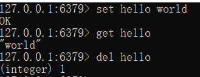
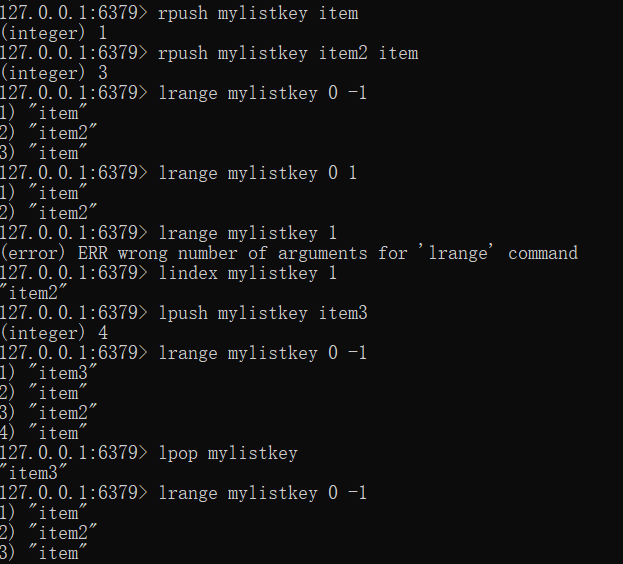
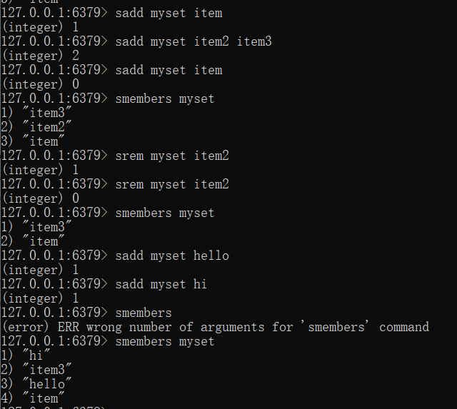
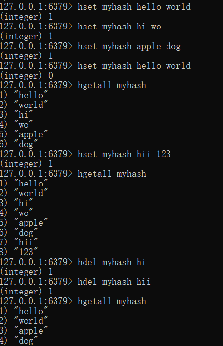
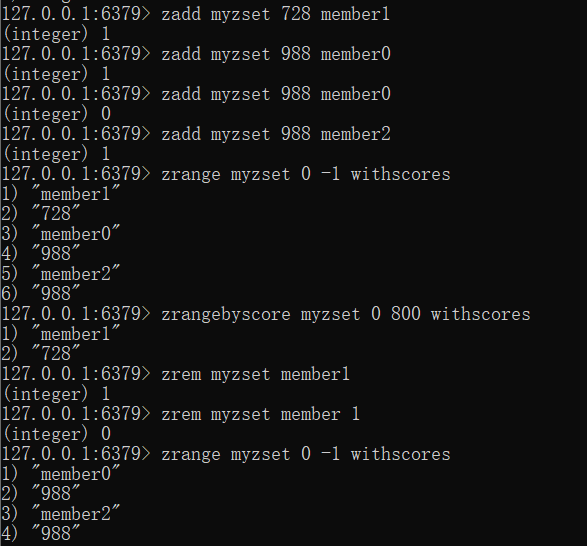

# Redis数据类型

Redis数据类型：

1. String：存储字符串、整数、浮点数；对整个字符串或者字符串的一部分进行操作，对整数和浮点数进行自增自减操作；

2. List：列表；从两端压入或弹出元素，对单个或多个元素进行修剪，只保留一个范围内的元素。

List是一个双端队列，支持两侧插入，弹出。

3. Set:无序集合；

添加、获取、移除单个元素，检查一个元素是否存在于集合中，计算交集、并集、差集，从集合中随机获取元素。

set可以去重，但是不能保证有序。与java中set类似。

4.Hash:包含键值对的无序散列表；

添加、获取、移除单个键值对；获取所有键值对；检查某个键是否存在

无序散列表，HashMap

5.ZSet：有序集合

添加、获取、删除元素；根据分值范围或者成员来获取元素；计算一个键的排名

有序，支持去重，且支持按照分值范围查找。
