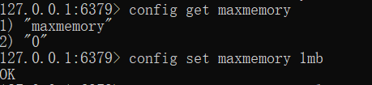
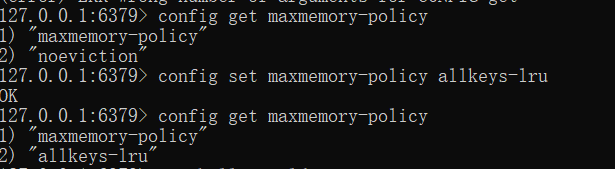
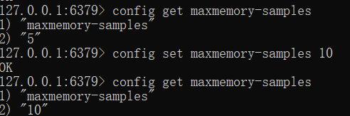

# Redis缓存淘汰策略

Redis缓存淘汰策略

1. 可用内存：查看当前redis可用内存，如果设置为0或者不设置默认32位3G，64位不限；

2. 缓存淘汰策略：

Redis4.0以下的版本，有：

（1）noeviction(默认策略)：不淘汰，当内存占用满以后，对写的请求直接返回错误（不包括DEL和部分特殊请求）；

（2）allkeys-lru：对所有的key进行LRU淘汰，淘汰最近最少使用的。

（3）volatile-lru：对设置了过期时间的进行LRU。

（4）allkeys-random：从所有key中随机淘汰。

（5）volatile-random：从设置了过期时间的key中进行随机淘汰。

（6）volatile-ttl：对设置了过期时间的key中，对设置了过期时间的key进行淘汰，越早过期的越先被淘汰。

以上策略中的(3)(5)(6)中，如果没有可淘汰的key，同默认策略一样返回错误。

3. 通过命令修改缓存淘汰策略：

4. LRU在Redis中的实现：

（1）近似LRU算法

Redis使用的是一种近似的LRU算法，个人理解是出于性能考虑，全局扫描所有key性能较差，所以有一个采样数据，默认值是5，可以更改；随机选取5个key，再对这5个key使用LRU算法进行淘汰。理论上采样数据越大，越接近严格的LRU算法，这也是一种性能和准确性之间的权衡。

Redis为了实现LRU，给每个key增加了一个24bit的字段，用来存储该key的最后一次访问时间。

（2）Redis3.0对LRU的优化

Redis3.0维护了一个大小为16的候选池，第一次随机选取的key全部放入候选池；之后，随机选取的key只有在最后使用时间小于候选池中最后使用时间最小的key时才会被放入；候选池放满以后，下次随机到的key如果满足被放入的条件，需要把候选池中最后使用时间最大的key移出候选池。

5. LFU算法

LFU是Redis4.0新增的缓存淘汰策略，根据使用频率进行淘汰，优先淘汰使用频率最少的key。

LFU有两种策略：

（1）volatile-lfu：在设置了过期时间的key中使用LFU算法淘汰key

（2）allkeys-lfu：在所有的key中使用LFU算法淘汰数据
