# Bean生命周期

Bean的生命周期

1. 什么是Bean

Bean: Spring管理的对象

class -> 对象 -> 填充属性 -> 放到单例池 -> bean对象

2. Bean的实例化初始化过程

实例化

实例化前 ----  判断是否能直接得到bean，如果能直接得到，不需要后面的步骤

调用InstantiationAwareBeanPostProcessor接口的	postProcessBeforeInstantiation()方法;

可以手动实现用来扩展；如果返回null，会走Spring的默认逻辑

实例化  ---- 推断构造，new对象（通过构造方法反射得到的对象）

实例化后

调用InstantiationAwareBeanPostProcessor接口的postProcessAfterInstantiation()方法；

去填充属性

初始化

初始化前

初始化 ---- InitializingBean等 : 实现该接口的afterPropertiesSet()可以对Bean的属性进行初始化

初始化后 ---- AOP代理对象: 如果配置了切面，基于初始化的Bean对象创建代理对象。

放入单例池

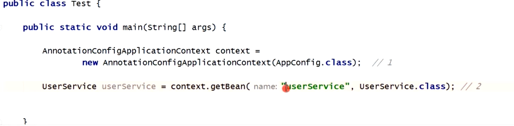

单例Bean在上面第一段代码生成，放入单例池中；原型Bean在第二行代码生成。

3. 第一段代码生成单例Bean实例化前

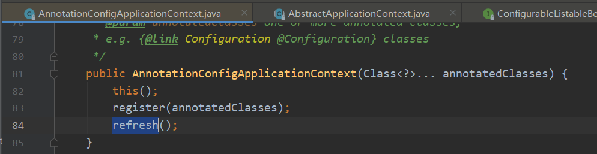

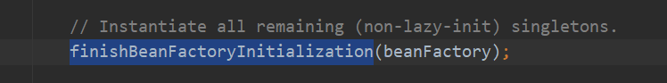

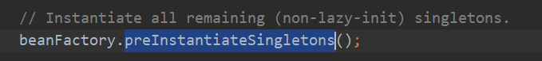

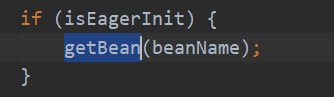

无需进入，仅关注

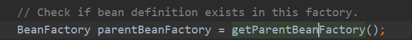

无需进入，仅关注

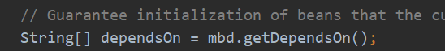

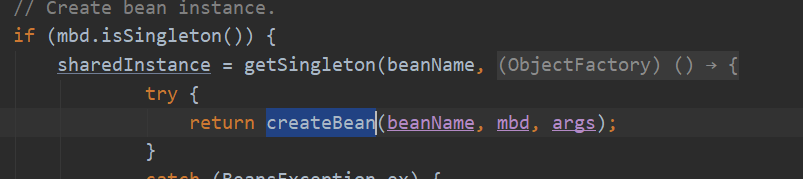

实例化前

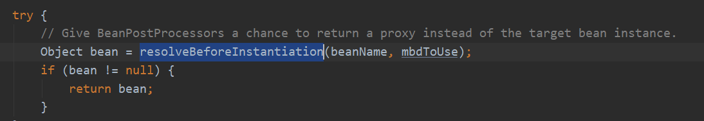

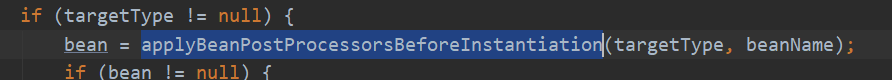

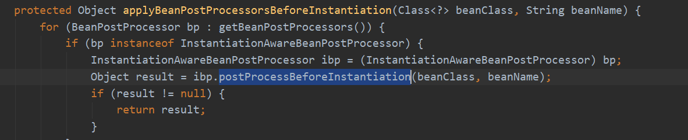

可以自己实现该接口，实现实例化前的功能，自己定制需要的Bean

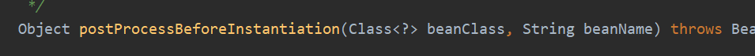

4. 实例化与实例化后流程

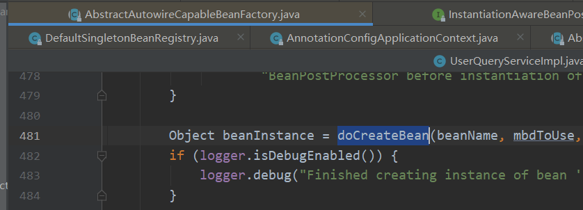

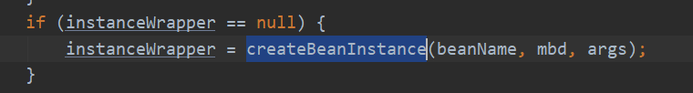

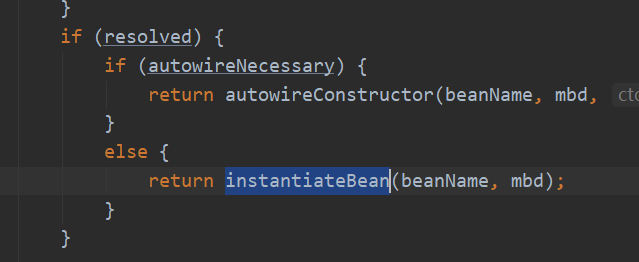

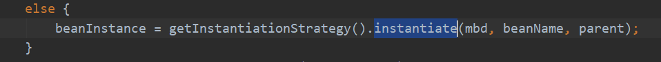

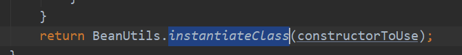

通过构造方法反射得到一个对象

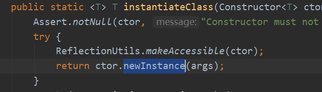

得到实例化对象

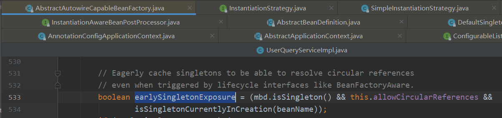

填充属性

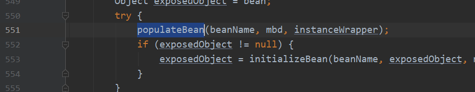

实例化后

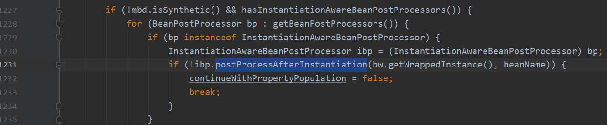

5. 初始化

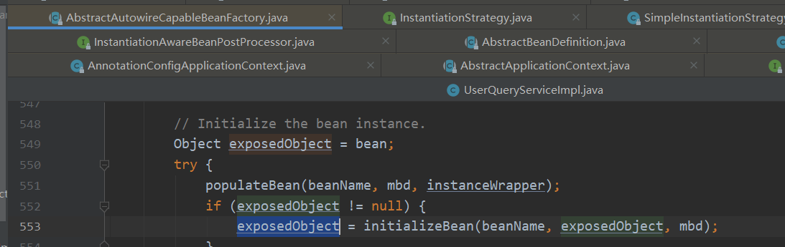

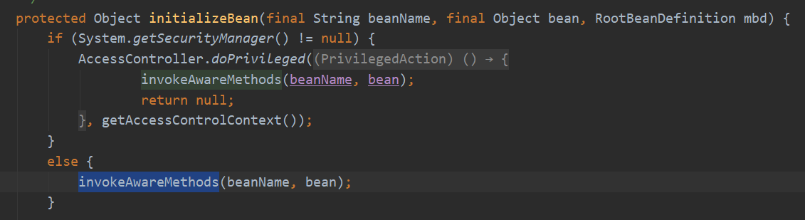

执行完这段代码以后，beanName, beanClassLoader, beanFactory就都有值了。

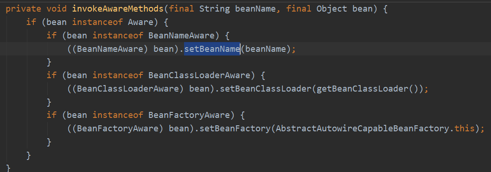

可以手动实现BeanNameAware接口，就可以拿到当前bean的beanName;

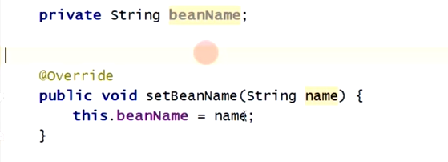
